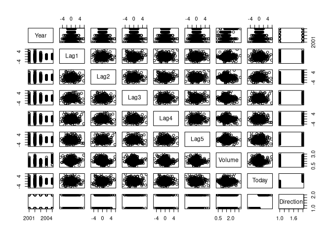
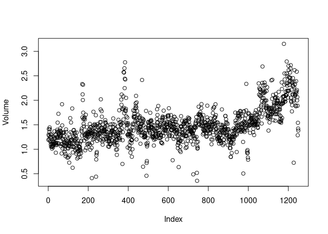
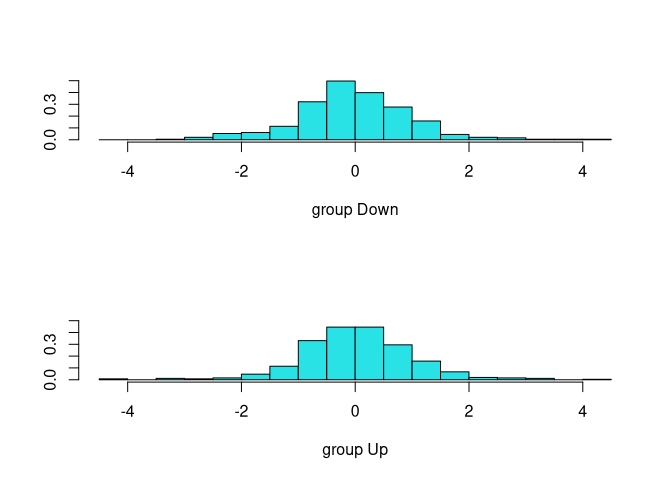
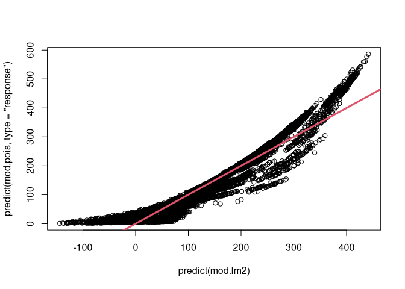

Chapter 4 Labs
================

-   [Stock Market Data](#stock-market-data)
-   [Logistic Regression](#logistic-regression)
-   [Linear Discriminant Analysis](#linear-discriminant-analysis)
-   [Quadratic Discriminant Analysis](#quadratic-discriminant-analysis)
-   [Naive Bayes](#naive-bayes)
-   [K-Nearest Neighbors](#k-nearest-neighbors)
-   [Poisson Regression](#poisson-regression)

## Stock Market Data

We’ll look a little bit at the `Smarket` data.

``` r
library(ISLR2)
names(Smarket)
```

    ## [1] "Year"      "Lag1"      "Lag2"      "Lag3"      "Lag4"      "Lag5"     
    ## [7] "Volume"    "Today"     "Direction"

``` r
dim(Smarket)
```

    ## [1] 1250    9

``` r
summary(Smarket)
```

    ##       Year           Lag1                Lag2                Lag3          
    ##  Min.   :2001   Min.   :-4.922000   Min.   :-4.922000   Min.   :-4.922000  
    ##  1st Qu.:2002   1st Qu.:-0.639500   1st Qu.:-0.639500   1st Qu.:-0.640000  
    ##  Median :2003   Median : 0.039000   Median : 0.039000   Median : 0.038500  
    ##  Mean   :2003   Mean   : 0.003834   Mean   : 0.003919   Mean   : 0.001716  
    ##  3rd Qu.:2004   3rd Qu.: 0.596750   3rd Qu.: 0.596750   3rd Qu.: 0.596750  
    ##  Max.   :2005   Max.   : 5.733000   Max.   : 5.733000   Max.   : 5.733000  
    ##       Lag4                Lag5              Volume           Today          
    ##  Min.   :-4.922000   Min.   :-4.92200   Min.   :0.3561   Min.   :-4.922000  
    ##  1st Qu.:-0.640000   1st Qu.:-0.64000   1st Qu.:1.2574   1st Qu.:-0.639500  
    ##  Median : 0.038500   Median : 0.03850   Median :1.4229   Median : 0.038500  
    ##  Mean   : 0.001636   Mean   : 0.00561   Mean   :1.4783   Mean   : 0.003138  
    ##  3rd Qu.: 0.596750   3rd Qu.: 0.59700   3rd Qu.:1.6417   3rd Qu.: 0.596750  
    ##  Max.   : 5.733000   Max.   : 5.73300   Max.   :3.1525   Max.   : 5.733000  
    ##  Direction 
    ##  Down:602  
    ##  Up  :648  
    ##            
    ##            
    ##            
    ## 

``` r
pairs(Smarket)
```

<!-- -->

``` r
cor(Smarket[, -9]) %>% round(4)
```

    ##          Year    Lag1    Lag2    Lag3    Lag4    Lag5  Volume   Today
    ## Year   1.0000  0.0297  0.0306  0.0332  0.0357  0.0298  0.5390  0.0301
    ## Lag1   0.0297  1.0000 -0.0263 -0.0108 -0.0030 -0.0057  0.0409 -0.0262
    ## Lag2   0.0306 -0.0263  1.0000 -0.0259 -0.0109 -0.0036 -0.0434 -0.0103
    ## Lag3   0.0332 -0.0108 -0.0259  1.0000 -0.0241 -0.0188 -0.0418 -0.0024
    ## Lag4   0.0357 -0.0030 -0.0109 -0.0241  1.0000 -0.0271 -0.0484 -0.0069
    ## Lag5   0.0298 -0.0057 -0.0036 -0.0188 -0.0271  1.0000 -0.0220 -0.0349
    ## Volume 0.5390  0.0409 -0.0434 -0.0418 -0.0484 -0.0220  1.0000  0.0146
    ## Today  0.0301 -0.0262 -0.0103 -0.0024 -0.0069 -0.0349  0.0146  1.0000

``` r
attach(Smarket)
plot(Volume)
```

<!-- -->

## Logistic Regression

We’ll look at fitting a logistic regression model to predict `Direction`
using `Lag1` through `Lag5` and `Volume`. We will use the `glm()`
function with `family = binomial` to indicate that we are performing
logistic regression rather than some other form of linear model.

``` r
glm.fits <- glm(
    Direction ~ Lag1 + Lag2 + Lag3 + Lag4 + Lag5 + Volume, 
    data = Smarket, family = binomial
)
summary(glm.fits)
```

    ## 
    ## Call:
    ## glm(formula = Direction ~ Lag1 + Lag2 + Lag3 + Lag4 + Lag5 + 
    ##     Volume, family = binomial, data = Smarket)
    ## 
    ## Deviance Residuals: 
    ##    Min      1Q  Median      3Q     Max  
    ## -1.446  -1.203   1.065   1.145   1.326  
    ## 
    ## Coefficients:
    ##              Estimate Std. Error z value Pr(>|z|)
    ## (Intercept) -0.126000   0.240736  -0.523    0.601
    ## Lag1        -0.073074   0.050167  -1.457    0.145
    ## Lag2        -0.042301   0.050086  -0.845    0.398
    ## Lag3         0.011085   0.049939   0.222    0.824
    ## Lag4         0.009359   0.049974   0.187    0.851
    ## Lag5         0.010313   0.049511   0.208    0.835
    ## Volume       0.135441   0.158360   0.855    0.392
    ## 
    ## (Dispersion parameter for binomial family taken to be 1)
    ## 
    ##     Null deviance: 1731.2  on 1249  degrees of freedom
    ## Residual deviance: 1727.6  on 1243  degrees of freedom
    ## AIC: 1741.6
    ## 
    ## Number of Fisher Scoring iterations: 3

It makes sense here that the lowest p-value and negative coefficient is
associated with `Lag1`, because if the market went up yesterday, it’s
more likely to go down today. However, it doesn’t seem like there’s a
real association between any of these covariates and `Direction`.

We can access more specific information about just the coefficients
using either the `coef()` function or calling the `coefficients` item in
the model object.

``` r
glm.fits$coefficients
```

    ##  (Intercept)         Lag1         Lag2         Lag3         Lag4         Lag5 
    ## -0.126000257 -0.073073746 -0.042301344  0.011085108  0.009358938  0.010313068 
    ##       Volume 
    ##  0.135440659

``` r
summary(glm.fits)$coefficients
```

    ##                 Estimate Std. Error    z value  Pr(>|z|)
    ## (Intercept) -0.126000257 0.24073574 -0.5233966 0.6006983
    ## Lag1        -0.073073746 0.05016739 -1.4565986 0.1452272
    ## Lag2        -0.042301344 0.05008605 -0.8445733 0.3983491
    ## Lag3         0.011085108 0.04993854  0.2219750 0.8243333
    ## Lag4         0.009358938 0.04997413  0.1872757 0.8514445
    ## Lag5         0.010313068 0.04951146  0.2082966 0.8349974
    ## Volume       0.135440659 0.15835970  0.8552723 0.3924004

Now we can use the model we fit to predict probabilities based on a
given input.

``` r
glm.probs <- predict(glm.fits, type = "response")
glm.probs[1:10]
```

    ##         1         2         3         4         5         6         7         8 
    ## 0.5070841 0.4814679 0.4811388 0.5152224 0.5107812 0.5069565 0.4926509 0.5092292 
    ##         9        10 
    ## 0.5176135 0.4888378

``` r
contrasts(Direction)
```

    ##      Up
    ## Down  0
    ## Up    1

We can now work on making predictions for whether the market will go up
or down on a particular day. We do this by making a vector of length
equal to that of `Smarket`, assigning each one a value of down, then
changing individual elements to “Up” if the corresponding value from
`glm.probs` is greater than 0.5.

``` r
glm.pred <- rep("Down", 1250)
glm.pred[glm.probs > 0.5] = "Up"
```

Now we can look at a confusion matrix to see how good our model is.

``` r
table(glm.pred, Direction)
```

    ##         Direction
    ## glm.pred Down  Up
    ##     Down  145 141
    ##     Up    457 507

Our accuracy is given by the proportion of correct predictions, which we
can calculate with:

``` r
mean(glm.pred == Direction)
```

    ## [1] 0.5216

From this calculation, we can see that our logistic regression model is
accurate only 52.16% of the time. This gives us an error rate of 47.84%,
which is an *optimistic* error rate because we’ve used the whole data
set rather than using a subset for training.

Let’s now consider a model which we train using data from 2001 to 2004,
then use that to predict observations from 2005.

``` r
train <- (Year < 2005)
Smarket.2005 <- Smarket[!train, ]
dim(Smarket.2005)
```

    ## [1] 252   9

``` r
Direction.2005 <- Direction[!train]

glm.fits <- glm(
    Direction ~ Lag1 + Lag2 + Lag3 + Lag4 + Lag5 + Volume, 
    data = Smarket, family = binomial, subset = train
)
glm.probs <- predict(glm.fits, Smarket.2005, type = "response")

glm.pred <- rep("Down", length(glm.probs))
glm.pred[glm.probs > 0.5] <- "Up"
table(glm.pred, Direction.2005)
```

    ##         Direction.2005
    ## glm.pred Down Up
    ##     Down   77 97
    ##     Up     34 44

``` r
mean(glm.pred == Direction.2005) # Accuracy 
```

    ## [1] 0.4801587

``` r
mean(glm.pred != Direction.2005) # Error rate
```

    ## [1] 0.5198413

It turns out that our model which uses the 2001 through 2004 data as a
training set performs *worse* than even random guessing. And of course,
it performs worse than our first model because in our first model, we
used the whole data set as a training set, whereas here we subsetted
just four years to train on.

Let’s try another model. From our `glm` summary earlier, it appeared as
though `Lag1` and `Lag2` were the only really useful predictors, so
let’s try fitting a logistic regression model using just those two as
predictors with the same training subset we just used.

``` r
glm.fits <- glm(
    Direction ~ Lag1 + Lag2, 
    data = Smarket, family = binomial, subset = train
)
glm.probs <- predict(glm.fits, Smarket.2005, type = "response")
glm.pred <- rep("Down", length(glm.probs))
glm.pred[glm.probs > 0.5] <- "Up"

table(glm.pred, Direction.2005)
```

    ##         Direction.2005
    ## glm.pred Down  Up
    ##     Down   35  35
    ##     Up     76 106

``` r
mean(glm.pred == Direction.2005) # Accuracy
```

    ## [1] 0.5595238

``` r
mean(glm.pred != Direction.2005) # Error Rate
```

    ## [1] 0.4404762

This model also doesn’t bode well for predicting the stock market. It
turns out that random guessing would be just as accurate as using this
model.

If we want to use this model to guess the direction based on a novel set
of data, we would use the following syntax:

``` r
predict(
    glm.fits, 
    newdata = data.frame(
        Lag1 = c(1.2, 1.5), 
        Lag2 = c(1.1, -0.8)
    ), 
    type = "response"
)
```

    ##         1         2 
    ## 0.4791462 0.4960939

## Linear Discriminant Analysis

We can now fit LDA on the `Smarket` data. The syntax of the `lda()`
function is identical to that of the `lm()` function. We will use the
same training set as before.

``` r
lda.fit <- lda(
    Direction ~ Lag1 + Lag2, 
    data = Smarket, subset = train
)
lda.fit
```

    ## Call:
    ## lda(Direction ~ Lag1 + Lag2, data = Smarket, subset = train)
    ## 
    ## Prior probabilities of groups:
    ##     Down       Up 
    ## 0.491984 0.508016 
    ## 
    ## Group means:
    ##             Lag1        Lag2
    ## Down  0.04279022  0.03389409
    ## Up   -0.03954635 -0.03132544
    ## 
    ## Coefficients of linear discriminants:
    ##             LD1
    ## Lag1 -0.6420190
    ## Lag2 -0.5135293

``` r
plot(lda.fit)
```

<!-- -->

The LDA model provides us with all the values necessary to do Linear
Discriminant Analysis by hand, that is, the estimates of the parameters
used in the discriminant function. The `plot()` function provides
distributions of the discriminant functions themselves, one for each
group (Up or Down).

``` r
lda.pred <- predict(lda.fit, Smarket.2005)
names(lda.pred)
```

    ## [1] "class"     "posterior" "x"

We observed in Section 4.5 that LDA and Logistic Regression predictions
are nearly identical. Let’s show that now.

``` r
lda.class <- lda.pred$class
table(lda.class, Direction.2005)
```

    ##          Direction.2005
    ## lda.class Down  Up
    ##      Down   35  35
    ##      Up     76 106

``` r
mean(lda.class == Direction.2005) # Accuracy
```

    ## [1] 0.5595238

``` r
mean(lda.class != Direction.2005) # Error Rate
```

    ## [1] 0.4404762

## Quadratic Discriminant Analysis

Fitting a QDA model works just the same as the LDA model, also from the
`MASS` package.

``` r
qda.fit <- qda(
    Direction ~ Lag1 + Lag2, 
    data = Smarket, subset = train
)
qda.fit
```

    ## Call:
    ## qda(Direction ~ Lag1 + Lag2, data = Smarket, subset = train)
    ## 
    ## Prior probabilities of groups:
    ##     Down       Up 
    ## 0.491984 0.508016 
    ## 
    ## Group means:
    ##             Lag1        Lag2
    ## Down  0.04279022  0.03389409
    ## Up   -0.03954635 -0.03132544

``` r
qda.class <- predict(qda.fit, Smarket.2005)$class
table(qda.class, Direction.2005)
```

    ##          Direction.2005
    ## qda.class Down  Up
    ##      Down   30  20
    ##      Up     81 121

``` r
mean(qda.class == Direction.2005) # Accuracy
```

    ## [1] 0.5992063

``` r
mean(qda.class != Direction.2005) # Error Rate
```

    ## [1] 0.4007937

The accuracy of the QDA model is greater than that of Logistic
Regression and LDA, which implies that the quadratic model might capture
the true relationship more accurately than the linear forms from LDA and
Logistic Regression.

## Naive Bayes

We can also fit a naive Bayes classifier to the `Smarket` data, using
the `naiveBayes()` function from the `e1071` package. By default, this
naive Bayes classifier uses a Gaussian approximation for each
quantitative variable, but a kernel density method can also be used. The
syntax is the same as the previous models.

``` r
nb.fit <- naiveBayes(
    Direction ~ Lag1 + Lag2, 
    data = Smarket, subset = train
)
nb.fit
```

    ## 
    ## Naive Bayes Classifier for Discrete Predictors
    ## 
    ## Call:
    ## naiveBayes.default(x = X, y = Y, laplace = laplace)
    ## 
    ## A-priori probabilities:
    ## Y
    ##     Down       Up 
    ## 0.491984 0.508016 
    ## 
    ## Conditional probabilities:
    ##       Lag1
    ## Y             [,1]     [,2]
    ##   Down  0.04279022 1.227446
    ##   Up   -0.03954635 1.231668
    ## 
    ##       Lag2
    ## Y             [,1]     [,2]
    ##   Down  0.03389409 1.239191
    ##   Up   -0.03132544 1.220765

This function computes the estimated mean and standard deviation for
each variable in the class, and we can verify this:

``` r
mean(Lag1[train][Direction[train] == "Down"])
```

    ## [1] 0.04279022

``` r
sd(Lag1[train][Direction[train] == "Down"])
```

    ## [1] 1.227446

We can then predict just the same as the other models:

``` r
nb.class <- predict(nb.fit, Smarket.2005)
table(nb.class, Direction.2005)
```

    ##         Direction.2005
    ## nb.class Down  Up
    ##     Down   28  20
    ##     Up     83 121

``` r
mean(nb.class == Direction.2005) # Accuracy
```

    ## [1] 0.5912698

``` r
mean(nb.class != Direction.2005) # Error Rate
```

    ## [1] 0.4087302

This model performs only slightly worse than QDA, but much better than
LDA.

The `predict()` function can also output the probability that a
particular observation belongs to a certain class:

``` r
nb.preds <- predict(nb.fit, Smarket.2005, type = "raw")
nb.preds[1:5, ]
```

    ##           Down        Up
    ## [1,] 0.4873164 0.5126836
    ## [2,] 0.4762492 0.5237508
    ## [3,] 0.4653377 0.5346623
    ## [4,] 0.4748652 0.5251348
    ## [5,] 0.4901890 0.5098110

## K-Nearest Neighbors

We can also train a KNN classifier using the `knn()` function from the
`class` library. This model does **not** work the same as the other
model functions we’ve been using, and instead we need to create a few
different inputs:

-   `train.X` is a matrix containing predictors associated with the
    training data
-   `test.X` is the corresponding matrix for the test data
-   `train.Direction` (also sometimes called `train.y`) contains class
    labels for the training set
-   A value for K, the number of nearest neighbors to be used by the
    classifier.

``` r
train.X <- cbind(Lag1, Lag2)[train, ]
test.X <- cbind(Lag1, Lag2)[!train, ]
train.Direction <- Direction[train]
```

We can now run the classifier. We’ll use a set seed to get the same
result every time.

``` r
set.seed(1)
knn.pred <- knn(train.X, test.X, train.Direction, k = 1)
table(knn.pred, Direction.2005)
```

    ##         Direction.2005
    ## knn.pred Down Up
    ##     Down   43 58
    ##     Up     68 83

``` r
mean(knn.pred == Direction.2005) # Accuracy
```

    ## [1] 0.5

``` r
mean(knn.pred != Direction.2005) # Error Rate
```

    ## [1] 0.5

This is not a good result. Changing the value of K and rerunning the
model can improve it slightly:

``` r
knn.pred <- knn(train.X, test.X, train.Direction, k=2)
mean(knn.pred == Direction.2005) # Accuracy
```

    ## [1] 0.5198413

``` r
knn.pred <- knn(train.X, test.X, train.Direction, k=3)
mean(knn.pred == Direction.2005) # Accuracy
```

    ## [1] 0.531746

KNN works well on data with many observations, and 1250 observations is
not a very large amount.

We can look instead at the `Caravan` data set from the `ISLR2` package,
where we’ll analyze `Purchase` as a response variable, which indicates
whether or not a given individual purchases a caravan insurance policy.

``` r
dim(Caravan)
```

    ## [1] 5822   86

``` r
attach(Caravan)
summary(Purchase)
```

    ##   No  Yes 
    ## 5474  348

For K-nearest neighbors, the classification depends on the Euclidian
distance between two points. Because of this, it follows naturally that
variables with a larger *scale* have a larger impact on the
classification. Thus, we need to scale down all the variables in a
process called *standardization*. This can be done with the `scale`
function.

``` r
standardized.X <- scale(Caravan[, -86])
var(Caravan[, 1])
```

    ## [1] 165.0378

``` r
var(Caravan[, 2])
```

    ## [1] 0.1647078

``` r
var(standardized.X[, 1])
```

    ## [1] 1

``` r
var(standardized.X[, 2])
```

    ## [1] 1

Now every column has the same standard deviation/variance. We can now
fit the model, with K=1:

``` r
test <- 1:1000
train.X <- standardized.X[-test, ]
test.X <- standardized.X[test, ]
train.Y <- Purchase[-test]
test.Y <- Purchase[test]
set.seed(1)
knn.pred <- knn(train.X, test.X, train.Y, k=1)
table(knn.pred, test.Y)
```

    ##         test.Y
    ## knn.pred  No Yes
    ##      No  873  50
    ##      Yes  68   9

``` r
mean(knn.pred == test.Y) # Accuracy
```

    ## [1] 0.882

``` r
mean(knn.pred != test.Y) # Error Rate
```

    ## [1] 0.118

``` r
mean(test.Y != "No")
```

    ## [1] 0.059

The last calculation done there is the proportion of people who
responded “Yes” in the test set. So while our accuracy looks good, we
can get a better prediction by just guessing “No” for every observation.

How can we make our model better? Well, consider that the insurance
company might only want to try to sell insurance to a random selection
of customers. Rather than the total proportion of people who buy it, we
only care about the fraction of individuals who are correctly predicted
to buy insurance.

``` r
table(knn.pred, test.Y)
```

    ##         test.Y
    ## knn.pred  No Yes
    ##      No  873  50
    ##      Yes  68   9

``` r
9 / ( 68 + 9)
```

    ## [1] 0.1168831

Increasing to K=3, we get:

``` r
knn.pred <- knn(train.X, test.X, train.Y, k=3)
table(knn.pred, test.Y)
```

    ##         test.Y
    ## knn.pred  No Yes
    ##      No  920  54
    ##      Yes  21   5

``` r
5 / ( 21 + 5)
```

    ## [1] 0.1923077

Now our success rate jumps to 19%. Let’s try with K=5:

``` r
knn.pred <- knn(train.X, test.X, train.Y, k=5)
table(knn.pred, test.Y)
```

    ##         test.Y
    ## knn.pred  No Yes
    ##      No  930  55
    ##      Yes  11   4

``` r
4 / ( 11 + 4)
```

    ## [1] 0.2666667

A success rate of almost 27% is much better than our initial success of
around 11%.

We can also fit a Logistic regression model to the data. If we use 0.5
as a cutoff, our model will be terrible. However, if we change that
cutoff to 0.25, we get much better results:

``` r
glm.fits <- glm(
    Purchase ~ ., data = Caravan, family = binomial, subset = -test
)
```

    ## Warning: glm.fit: fitted probabilities numerically 0 or 1 occurred

``` r
glm.probs <- predict(glm.fits, Caravan[test, ], 
                     type = "response")
glm.pred <- rep("No", 1000)
glm.pred[glm.probs > 0.5] <- "Yes" # Cutoff of 0.5
table(glm.pred, test.Y)
```

    ##         test.Y
    ## glm.pred  No Yes
    ##      No  934  59
    ##      Yes   7   0

``` r
0 / (7 + 0)
```

    ## [1] 0

``` r
glm.pred <- rep("No", 1000)
glm.pred[glm.probs > 0.25] <- "Yes" # Cutoff of 0.25
table(glm.pred, test.Y)
```

    ##         test.Y
    ## glm.pred  No Yes
    ##      No  919  48
    ##      Yes  22  11

``` r
11 / (22 + 11)
```

    ## [1] 0.3333333

This model is over five times better than random guessing!

## Poisson Regression

For this lab section, we’ll use the `Bikeshare` data from the `ISLR2`
library.

``` r
attach(Bikeshare)
dim(Bikeshare)
```

    ## [1] 8645   15

``` r
names(Bikeshare)
```

    ##  [1] "season"     "mnth"       "day"        "hr"         "holiday"   
    ##  [6] "weekday"    "workingday" "weathersit" "temp"       "atemp"     
    ## [11] "hum"        "windspeed"  "casual"     "registered" "bikers"

To start, we can fit a linear regression model:

``` r
mod.lm <- lm(
    bikers ~ mnth + hr + workingday + temp + weathersit, 
    data = Bikeshare
)
summary(mod.lm)
```

    ## 
    ## Call:
    ## lm(formula = bikers ~ mnth + hr + workingday + temp + weathersit, 
    ##     data = Bikeshare)
    ## 
    ## Residuals:
    ##     Min      1Q  Median      3Q     Max 
    ## -299.00  -45.70   -6.23   41.08  425.29 
    ## 
    ## Coefficients:
    ##                           Estimate Std. Error t value Pr(>|t|)    
    ## (Intercept)                -68.632      5.307 -12.932  < 2e-16 ***
    ## mnthFeb                      6.845      4.287   1.597 0.110398    
    ## mnthMarch                   16.551      4.301   3.848 0.000120 ***
    ## mnthApril                   41.425      4.972   8.331  < 2e-16 ***
    ## mnthMay                     72.557      5.641  12.862  < 2e-16 ***
    ## mnthJune                    67.819      6.544  10.364  < 2e-16 ***
    ## mnthJuly                    45.324      7.081   6.401 1.63e-10 ***
    ## mnthAug                     53.243      6.640   8.019 1.21e-15 ***
    ## mnthSept                    66.678      5.925  11.254  < 2e-16 ***
    ## mnthOct                     75.834      4.950  15.319  < 2e-16 ***
    ## mnthNov                     60.310      4.610  13.083  < 2e-16 ***
    ## mnthDec                     46.458      4.271  10.878  < 2e-16 ***
    ## hr1                        -14.579      5.699  -2.558 0.010536 *  
    ## hr2                        -21.579      5.733  -3.764 0.000168 ***
    ## hr3                        -31.141      5.778  -5.389 7.26e-08 ***
    ## hr4                        -36.908      5.802  -6.361 2.11e-10 ***
    ## hr5                        -24.135      5.737  -4.207 2.61e-05 ***
    ## hr6                         20.600      5.704   3.612 0.000306 ***
    ## hr7                        120.093      5.693  21.095  < 2e-16 ***
    ## hr8                        223.662      5.690  39.310  < 2e-16 ***
    ## hr9                        120.582      5.693  21.182  < 2e-16 ***
    ## hr10                        83.801      5.705  14.689  < 2e-16 ***
    ## hr11                       105.423      5.722  18.424  < 2e-16 ***
    ## hr12                       137.284      5.740  23.916  < 2e-16 ***
    ## hr13                       136.036      5.760  23.617  < 2e-16 ***
    ## hr14                       126.636      5.776  21.923  < 2e-16 ***
    ## hr15                       132.087      5.780  22.852  < 2e-16 ***
    ## hr16                       178.521      5.772  30.927  < 2e-16 ***
    ## hr17                       296.267      5.749  51.537  < 2e-16 ***
    ## hr18                       269.441      5.736  46.976  < 2e-16 ***
    ## hr19                       186.256      5.714  32.596  < 2e-16 ***
    ## hr20                       125.549      5.704  22.012  < 2e-16 ***
    ## hr21                        87.554      5.693  15.378  < 2e-16 ***
    ## hr22                        59.123      5.689  10.392  < 2e-16 ***
    ## hr23                        26.838      5.688   4.719 2.41e-06 ***
    ## workingday                   1.270      1.784   0.711 0.476810    
    ## temp                       157.209     10.261  15.321  < 2e-16 ***
    ## weathersitcloudy/misty     -12.890      1.964  -6.562 5.60e-11 ***
    ## weathersitlight rain/snow  -66.494      2.965 -22.425  < 2e-16 ***
    ## weathersitheavy rain/snow -109.745     76.667  -1.431 0.152341    
    ## ---
    ## Signif. codes:  0 '***' 0.001 '**' 0.01 '*' 0.05 '.' 0.1 ' ' 1
    ## 
    ## Residual standard error: 76.5 on 8605 degrees of freedom
    ## Multiple R-squared:  0.6745, Adjusted R-squared:  0.6731 
    ## F-statistic: 457.3 on 39 and 8605 DF,  p-value: < 2.2e-16

In this model, we treat hour 0 and month = January as being the baseline
classes, so no estimates are provided for them. An alternative coding
for the model is as follows:

``` r
contrasts(Bikeshare$hr) = contr.sum(24)
contrasts(Bikeshare$mnth) = contr.sum(12)
mod.lm2 <- lm(
    bikers ~ mnth + hr + workingday + temp + weathersit, 
    data = Bikeshare
)
summary(mod.lm2)
```

    ## 
    ## Call:
    ## lm(formula = bikers ~ mnth + hr + workingday + temp + weathersit, 
    ##     data = Bikeshare)
    ## 
    ## Residuals:
    ##     Min      1Q  Median      3Q     Max 
    ## -299.00  -45.70   -6.23   41.08  425.29 
    ## 
    ## Coefficients:
    ##                            Estimate Std. Error t value Pr(>|t|)    
    ## (Intercept)                 73.5974     5.1322  14.340  < 2e-16 ***
    ## mnth1                      -46.0871     4.0855 -11.281  < 2e-16 ***
    ## mnth2                      -39.2419     3.5391 -11.088  < 2e-16 ***
    ## mnth3                      -29.5357     3.1552  -9.361  < 2e-16 ***
    ## mnth4                       -4.6622     2.7406  -1.701  0.08895 .  
    ## mnth5                       26.4700     2.8508   9.285  < 2e-16 ***
    ## mnth6                       21.7317     3.4651   6.272 3.75e-10 ***
    ## mnth7                       -0.7626     3.9084  -0.195  0.84530    
    ## mnth8                        7.1560     3.5347   2.024  0.04295 *  
    ## mnth9                       20.5912     3.0456   6.761 1.46e-11 ***
    ## mnth10                      29.7472     2.6995  11.019  < 2e-16 ***
    ## mnth11                      14.2229     2.8604   4.972 6.74e-07 ***
    ## hr1                        -96.1420     3.9554 -24.307  < 2e-16 ***
    ## hr2                       -110.7213     3.9662 -27.916  < 2e-16 ***
    ## hr3                       -117.7212     4.0165 -29.310  < 2e-16 ***
    ## hr4                       -127.2828     4.0808 -31.191  < 2e-16 ***
    ## hr5                       -133.0495     4.1168 -32.319  < 2e-16 ***
    ## hr6                       -120.2775     4.0370 -29.794  < 2e-16 ***
    ## hr7                        -75.5424     3.9916 -18.925  < 2e-16 ***
    ## hr8                         23.9511     3.9686   6.035 1.65e-09 ***
    ## hr9                        127.5199     3.9500  32.284  < 2e-16 ***
    ## hr10                        24.4399     3.9360   6.209 5.57e-10 ***
    ## hr11                       -12.3407     3.9361  -3.135  0.00172 ** 
    ## hr12                         9.2814     3.9447   2.353  0.01865 *  
    ## hr13                        41.1417     3.9571  10.397  < 2e-16 ***
    ## hr14                        39.8939     3.9750  10.036  < 2e-16 ***
    ## hr15                        30.4940     3.9910   7.641 2.39e-14 ***
    ## hr16                        35.9445     3.9949   8.998  < 2e-16 ***
    ## hr17                        82.3786     3.9883  20.655  < 2e-16 ***
    ## hr18                       200.1249     3.9638  50.488  < 2e-16 ***
    ## hr19                       173.2989     3.9561  43.806  < 2e-16 ***
    ## hr20                        90.1138     3.9400  22.872  < 2e-16 ***
    ## hr21                        29.4071     3.9362   7.471 8.74e-14 ***
    ## hr22                        -8.5883     3.9332  -2.184  0.02902 *  
    ## hr23                       -37.0194     3.9344  -9.409  < 2e-16 ***
    ## workingday                   1.2696     1.7845   0.711  0.47681    
    ## temp                       157.2094    10.2612  15.321  < 2e-16 ***
    ## weathersitcloudy/misty     -12.8903     1.9643  -6.562 5.60e-11 ***
    ## weathersitlight rain/snow  -66.4944     2.9652 -22.425  < 2e-16 ***
    ## weathersitheavy rain/snow -109.7446    76.6674  -1.431  0.15234    
    ## ---
    ## Signif. codes:  0 '***' 0.001 '**' 0.01 '*' 0.05 '.' 0.1 ' ' 1
    ## 
    ## Residual standard error: 76.5 on 8605 degrees of freedom
    ## Multiple R-squared:  0.6745, Adjusted R-squared:  0.6731 
    ## F-statistic: 457.3 on 39 and 8605 DF,  p-value: < 2.2e-16

In practice, these two codings are the same, but the second one is used
in Section 4.6.1.

``` r
all.equal(predict(mod.lm), predict(mod.lm2))
```

    ## [1] TRUE

We can now fit a Poisson model using the `glm()` function:

``` r
mod.pois <- glm(
    bikers ~ mnth + hr + workingday + temp + weathersit, 
    data = Bikeshare, family = poisson
)
summary(mod.pois)
```

    ## 
    ## Call:
    ## glm(formula = bikers ~ mnth + hr + workingday + temp + weathersit, 
    ##     family = poisson, data = Bikeshare)
    ## 
    ## Deviance Residuals: 
    ##      Min        1Q    Median        3Q       Max  
    ## -20.7574   -3.3441   -0.6549    2.6999   21.9628  
    ## 
    ## Coefficients:
    ##                            Estimate Std. Error  z value Pr(>|z|)    
    ## (Intercept)                4.118245   0.006021  683.964  < 2e-16 ***
    ## mnth1                     -0.670170   0.005907 -113.445  < 2e-16 ***
    ## mnth2                     -0.444124   0.004860  -91.379  < 2e-16 ***
    ## mnth3                     -0.293733   0.004144  -70.886  < 2e-16 ***
    ## mnth4                      0.021523   0.003125    6.888 5.66e-12 ***
    ## mnth5                      0.240471   0.002916   82.462  < 2e-16 ***
    ## mnth6                      0.223235   0.003554   62.818  < 2e-16 ***
    ## mnth7                      0.103617   0.004125   25.121  < 2e-16 ***
    ## mnth8                      0.151171   0.003662   41.281  < 2e-16 ***
    ## mnth9                      0.233493   0.003102   75.281  < 2e-16 ***
    ## mnth10                     0.267573   0.002785   96.091  < 2e-16 ***
    ## mnth11                     0.150264   0.003180   47.248  < 2e-16 ***
    ## hr1                       -0.754386   0.007879  -95.744  < 2e-16 ***
    ## hr2                       -1.225979   0.009953 -123.173  < 2e-16 ***
    ## hr3                       -1.563147   0.011869 -131.702  < 2e-16 ***
    ## hr4                       -2.198304   0.016424 -133.846  < 2e-16 ***
    ## hr5                       -2.830484   0.022538 -125.586  < 2e-16 ***
    ## hr6                       -1.814657   0.013464 -134.775  < 2e-16 ***
    ## hr7                       -0.429888   0.006896  -62.341  < 2e-16 ***
    ## hr8                        0.575181   0.004406  130.544  < 2e-16 ***
    ## hr9                        1.076927   0.003563  302.220  < 2e-16 ***
    ## hr10                       0.581769   0.004286  135.727  < 2e-16 ***
    ## hr11                       0.336852   0.004720   71.372  < 2e-16 ***
    ## hr12                       0.494121   0.004392  112.494  < 2e-16 ***
    ## hr13                       0.679642   0.004069  167.040  < 2e-16 ***
    ## hr14                       0.673565   0.004089  164.722  < 2e-16 ***
    ## hr15                       0.624910   0.004178  149.570  < 2e-16 ***
    ## hr16                       0.653763   0.004132  158.205  < 2e-16 ***
    ## hr17                       0.874301   0.003784  231.040  < 2e-16 ***
    ## hr18                       1.294635   0.003254  397.848  < 2e-16 ***
    ## hr19                       1.212281   0.003321  365.084  < 2e-16 ***
    ## hr20                       0.914022   0.003700  247.065  < 2e-16 ***
    ## hr21                       0.616201   0.004191  147.045  < 2e-16 ***
    ## hr22                       0.364181   0.004659   78.173  < 2e-16 ***
    ## hr23                       0.117493   0.005225   22.488  < 2e-16 ***
    ## workingday                 0.014665   0.001955    7.502 6.27e-14 ***
    ## temp                       0.785292   0.011475   68.434  < 2e-16 ***
    ## weathersitcloudy/misty    -0.075231   0.002179  -34.528  < 2e-16 ***
    ## weathersitlight rain/snow -0.575800   0.004058 -141.905  < 2e-16 ***
    ## weathersitheavy rain/snow -0.926287   0.166782   -5.554 2.79e-08 ***
    ## ---
    ## Signif. codes:  0 '***' 0.001 '**' 0.01 '*' 0.05 '.' 0.1 ' ' 1
    ## 
    ## (Dispersion parameter for poisson family taken to be 1)
    ## 
    ##     Null deviance: 1052921  on 8644  degrees of freedom
    ## Residual deviance:  228041  on 8605  degrees of freedom
    ## AIC: 281159
    ## 
    ## Number of Fisher Scoring iterations: 5

``` r
plot(predict(mod.lm2), predict(mod.pois, type = "response"))
abline(0, 1, col = 2, lwd = 3)
```

<!-- -->
