Chapter 6 Labs
================

-   [Subset Selection Methods](#subset-selection-methods)
    -   [Best Subset Selection](#best-subset-selection)
    -   [Forward and Backward Stepwise
        Selection](#forward-and-backward-stepwise-selection)
    -   [Validation Set and Cross
        Validation](#validation-set-and-cross-validation)
-   [Ridge Regression and the Lasso](#ridge-regression-and-the-lasso)
    -   [Ridge Regression](#ridge-regression)
    -   [The Lasso](#the-lasso)
-   [PCR and PLS Regression](#pcr-and-pls-regression)
    -   [Principal Components
        Regression](#principal-components-regression)
    -   [Partial Least Squares](#partial-least-squares)

## Subset Selection Methods

We’ll apply subset selection methods to the `Hitters` data, and we wish
to predict a player’s `Salary` on the basis of various statistics
associated with their performance in the previous year.

### Best Subset Selection

We’ll start by looking at the `Hitters` data, and noticing that there
are 59 NA values, so we will remove them.

``` r
Hitters %>% head(5)
```

    ##                   AtBat Hits HmRun Runs RBI Walks Years CAtBat CHits CHmRun
    ## -Andy Allanson      293   66     1   30  29    14     1    293    66      1
    ## -Alan Ashby         315   81     7   24  38    39    14   3449   835     69
    ## -Alvin Davis        479  130    18   66  72    76     3   1624   457     63
    ## -Andre Dawson       496  141    20   65  78    37    11   5628  1575    225
    ## -Andres Galarraga   321   87    10   39  42    30     2    396   101     12
    ##                   CRuns CRBI CWalks League Division PutOuts Assists Errors
    ## -Andy Allanson       30   29     14      A        E     446      33     20
    ## -Alan Ashby         321  414    375      N        W     632      43     10
    ## -Alvin Davis        224  266    263      A        W     880      82     14
    ## -Andre Dawson       828  838    354      N        E     200      11      3
    ## -Andres Galarraga    48   46     33      N        E     805      40      4
    ##                   Salary NewLeague
    ## -Andy Allanson        NA         A
    ## -Alan Ashby        475.0         N
    ## -Alvin Davis       480.0         A
    ## -Andre Dawson      500.0         N
    ## -Andres Galarraga   91.5         N

``` r
names(Hitters)
```

    ##  [1] "AtBat"     "Hits"      "HmRun"     "Runs"      "RBI"       "Walks"    
    ##  [7] "Years"     "CAtBat"    "CHits"     "CHmRun"    "CRuns"     "CRBI"     
    ## [13] "CWalks"    "League"    "Division"  "PutOuts"   "Assists"   "Errors"   
    ## [19] "Salary"    "NewLeague"

``` r
dim(Hitters)
```

    ## [1] 322  20

``` r
sum(is.na(Hitters$Salary))
```

    ## [1] 59

``` r
Hitters <- na.omit(Hitters)
dim(Hitters)
```

    ## [1] 263  20

``` r
sum(is.na(Hitters))
```

    ## [1] 0

From the `leaps` library, we can use the `regsubsets()` function to
perform best subset selection, where it measures the *best* using lowest
RSS. It has the same format as for a linear model, and `summary()` can
be called on it as well to get more information.

``` r
regfit_full <- regsubsets(Salary ~ ., data = Hitters)
summary(regfit_full)
```

    ## Subset selection object
    ## Call: regsubsets.formula(Salary ~ ., data = Hitters)
    ## 19 Variables  (and intercept)
    ##            Forced in Forced out
    ## AtBat          FALSE      FALSE
    ## Hits           FALSE      FALSE
    ## HmRun          FALSE      FALSE
    ## Runs           FALSE      FALSE
    ## RBI            FALSE      FALSE
    ## Walks          FALSE      FALSE
    ## Years          FALSE      FALSE
    ## CAtBat         FALSE      FALSE
    ## CHits          FALSE      FALSE
    ## CHmRun         FALSE      FALSE
    ## CRuns          FALSE      FALSE
    ## CRBI           FALSE      FALSE
    ## CWalks         FALSE      FALSE
    ## LeagueN        FALSE      FALSE
    ## DivisionW      FALSE      FALSE
    ## PutOuts        FALSE      FALSE
    ## Assists        FALSE      FALSE
    ## Errors         FALSE      FALSE
    ## NewLeagueN     FALSE      FALSE
    ## 1 subsets of each size up to 8
    ## Selection Algorithm: exhaustive
    ##          AtBat Hits HmRun Runs RBI Walks Years CAtBat CHits CHmRun CRuns CRBI
    ## 1  ( 1 ) " "   " "  " "   " "  " " " "   " "   " "    " "   " "    " "   "*" 
    ## 2  ( 1 ) " "   "*"  " "   " "  " " " "   " "   " "    " "   " "    " "   "*" 
    ## 3  ( 1 ) " "   "*"  " "   " "  " " " "   " "   " "    " "   " "    " "   "*" 
    ## 4  ( 1 ) " "   "*"  " "   " "  " " " "   " "   " "    " "   " "    " "   "*" 
    ## 5  ( 1 ) "*"   "*"  " "   " "  " " " "   " "   " "    " "   " "    " "   "*" 
    ## 6  ( 1 ) "*"   "*"  " "   " "  " " "*"   " "   " "    " "   " "    " "   "*" 
    ## 7  ( 1 ) " "   "*"  " "   " "  " " "*"   " "   "*"    "*"   "*"    " "   " " 
    ## 8  ( 1 ) "*"   "*"  " "   " "  " " "*"   " "   " "    " "   "*"    "*"   " " 
    ##          CWalks LeagueN DivisionW PutOuts Assists Errors NewLeagueN
    ## 1  ( 1 ) " "    " "     " "       " "     " "     " "    " "       
    ## 2  ( 1 ) " "    " "     " "       " "     " "     " "    " "       
    ## 3  ( 1 ) " "    " "     " "       "*"     " "     " "    " "       
    ## 4  ( 1 ) " "    " "     "*"       "*"     " "     " "    " "       
    ## 5  ( 1 ) " "    " "     "*"       "*"     " "     " "    " "       
    ## 6  ( 1 ) " "    " "     "*"       "*"     " "     " "    " "       
    ## 7  ( 1 ) " "    " "     "*"       "*"     " "     " "    " "       
    ## 8  ( 1 ) "*"    " "     "*"       "*"     " "     " "    " "

This outputs eight models by default, where they are enumerated based on
the number of predictors used. If we want to output the best model for
each number of predictors, we can do the following:

``` r
regfit_full <- regsubsets(Salary ~ ., data = Hitters, 
                          nvmax = ncol(Hitters)-1)
reg_summary <- summary(regfit_full)
names(reg_summary)
```

    ## [1] "which"  "rsq"    "rss"    "adjr2"  "cp"     "bic"    "outmat" "obj"

``` r
reg_summary$rsq
```

    ##  [1] 0.3214501 0.4252237 0.4514294 0.4754067 0.4908036 0.5087146 0.5141227
    ##  [8] 0.5285569 0.5346124 0.5404950 0.5426153 0.5436302 0.5444570 0.5452164
    ## [15] 0.5454692 0.5457656 0.5459518 0.5460945 0.5461159

``` r
par(mfrow = c(2, 2))
plot(reg_summary$rss, xlab = "Number of Variables", 
     ylab = "RSS", type = "l")
plot(reg_summary$adjr2, xlab = "Number of Variables", 
     ylab = "Adjusted RSq", type = "l")
points(which.max(reg_summary$adjr2), reg_summary$adjr2[which.max(reg_summary$adjr2)], col = "red", cex = 2, pch = 20)
plot(reg_summary$cp, xlab = "Number of Variables", 
     ylab = "Cp", type = "l")
points(which.min(reg_summary$cp), reg_summary$cp[which.min(reg_summary$cp)], col = "red", cex = 2, pch = 20)
plot(reg_summary$bic, xlab = "Number of Variables", 
     ylab = "BIC", type = "l")
points (which.min(reg_summary$bic), reg_summary$bic[which.min(reg_summary$bic)], col = "red", cex = 2, pch = 20)
```

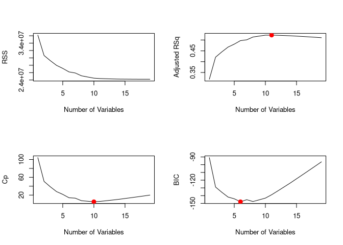<!-- -->

The `regsubsets()` function also has bulit-in `plot()` commands which
can be used to display the selected variables for the best model with a
given number of predictors, ranked according to different measurement
criteria (AIC, BIC, C_p, Adj. R^2, etc).

``` r
plot(regfit_full, scale = "r2")
```

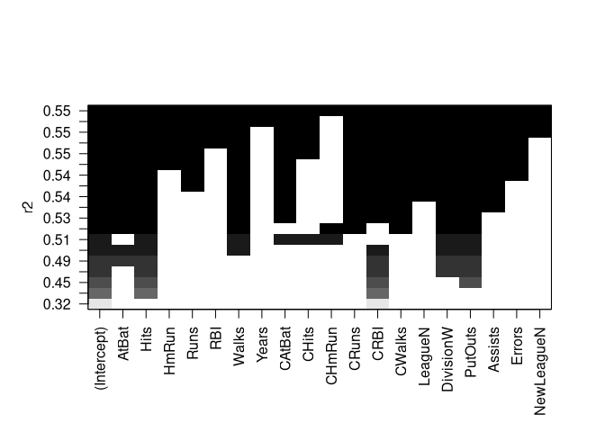<!-- -->

``` r
plot(regfit_full, scale = "adjr2") 
```

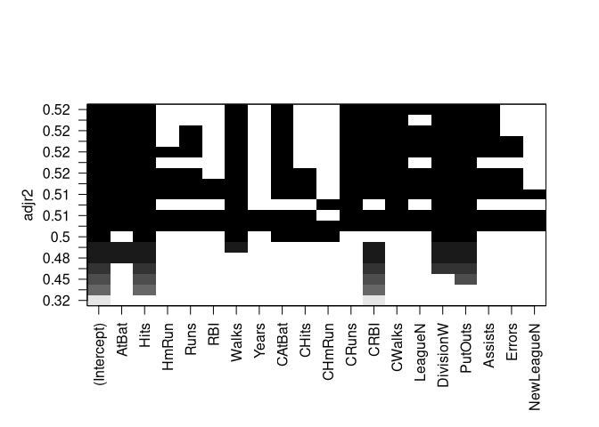<!-- -->

``` r
plot(regfit_full, scale = "Cp")
```

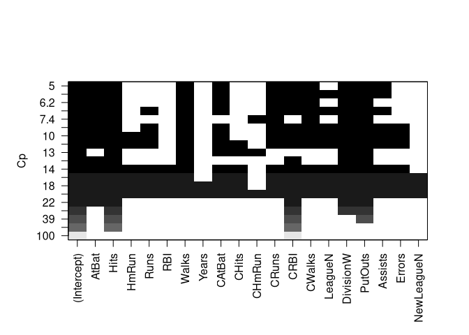<!-- -->

``` r
plot(regfit_full, scale = "bic")
```

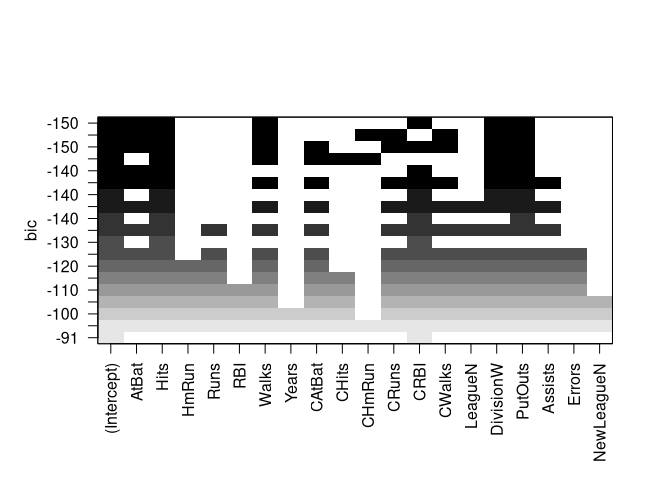<!-- -->

The top row of each of these plots gives a black square for each
variable which fits into the optimal model. The six-variable model has
the lowest BIC, so we can use the `coef()` function to see the
coefficient estimates associated with this model:

``` r
coef(regfit_full, 6)
```

    ##  (Intercept)        AtBat         Hits        Walks         CRBI    DivisionW 
    ##   91.5117981   -1.8685892    7.6043976    3.6976468    0.6430169 -122.9515338 
    ##      PutOuts 
    ##    0.2643076

### Forward and Backward Stepwise Selection

We can also use `regsubsets()` to perform forward and backward stepwise
selection, changing the `method` argument accordingly.

``` r
regfit_fwd <- regsubsets(Salary ~ ., data = Hitters, 
                         nvmax = 19, method = "forward")
summary(regfit_fwd)
```

    ## Subset selection object
    ## Call: regsubsets.formula(Salary ~ ., data = Hitters, nvmax = 19, method = "forward")
    ## 19 Variables  (and intercept)
    ##            Forced in Forced out
    ## AtBat          FALSE      FALSE
    ## Hits           FALSE      FALSE
    ## HmRun          FALSE      FALSE
    ## Runs           FALSE      FALSE
    ## RBI            FALSE      FALSE
    ## Walks          FALSE      FALSE
    ## Years          FALSE      FALSE
    ## CAtBat         FALSE      FALSE
    ## CHits          FALSE      FALSE
    ## CHmRun         FALSE      FALSE
    ## CRuns          FALSE      FALSE
    ## CRBI           FALSE      FALSE
    ## CWalks         FALSE      FALSE
    ## LeagueN        FALSE      FALSE
    ## DivisionW      FALSE      FALSE
    ## PutOuts        FALSE      FALSE
    ## Assists        FALSE      FALSE
    ## Errors         FALSE      FALSE
    ## NewLeagueN     FALSE      FALSE
    ## 1 subsets of each size up to 19
    ## Selection Algorithm: forward
    ##           AtBat Hits HmRun Runs RBI Walks Years CAtBat CHits CHmRun CRuns CRBI
    ## 1  ( 1 )  " "   " "  " "   " "  " " " "   " "   " "    " "   " "    " "   "*" 
    ## 2  ( 1 )  " "   "*"  " "   " "  " " " "   " "   " "    " "   " "    " "   "*" 
    ## 3  ( 1 )  " "   "*"  " "   " "  " " " "   " "   " "    " "   " "    " "   "*" 
    ## 4  ( 1 )  " "   "*"  " "   " "  " " " "   " "   " "    " "   " "    " "   "*" 
    ## 5  ( 1 )  "*"   "*"  " "   " "  " " " "   " "   " "    " "   " "    " "   "*" 
    ## 6  ( 1 )  "*"   "*"  " "   " "  " " "*"   " "   " "    " "   " "    " "   "*" 
    ## 7  ( 1 )  "*"   "*"  " "   " "  " " "*"   " "   " "    " "   " "    " "   "*" 
    ## 8  ( 1 )  "*"   "*"  " "   " "  " " "*"   " "   " "    " "   " "    "*"   "*" 
    ## 9  ( 1 )  "*"   "*"  " "   " "  " " "*"   " "   "*"    " "   " "    "*"   "*" 
    ## 10  ( 1 ) "*"   "*"  " "   " "  " " "*"   " "   "*"    " "   " "    "*"   "*" 
    ## 11  ( 1 ) "*"   "*"  " "   " "  " " "*"   " "   "*"    " "   " "    "*"   "*" 
    ## 12  ( 1 ) "*"   "*"  " "   "*"  " " "*"   " "   "*"    " "   " "    "*"   "*" 
    ## 13  ( 1 ) "*"   "*"  " "   "*"  " " "*"   " "   "*"    " "   " "    "*"   "*" 
    ## 14  ( 1 ) "*"   "*"  "*"   "*"  " " "*"   " "   "*"    " "   " "    "*"   "*" 
    ## 15  ( 1 ) "*"   "*"  "*"   "*"  " " "*"   " "   "*"    "*"   " "    "*"   "*" 
    ## 16  ( 1 ) "*"   "*"  "*"   "*"  "*" "*"   " "   "*"    "*"   " "    "*"   "*" 
    ## 17  ( 1 ) "*"   "*"  "*"   "*"  "*" "*"   " "   "*"    "*"   " "    "*"   "*" 
    ## 18  ( 1 ) "*"   "*"  "*"   "*"  "*" "*"   "*"   "*"    "*"   " "    "*"   "*" 
    ## 19  ( 1 ) "*"   "*"  "*"   "*"  "*" "*"   "*"   "*"    "*"   "*"    "*"   "*" 
    ##           CWalks LeagueN DivisionW PutOuts Assists Errors NewLeagueN
    ## 1  ( 1 )  " "    " "     " "       " "     " "     " "    " "       
    ## 2  ( 1 )  " "    " "     " "       " "     " "     " "    " "       
    ## 3  ( 1 )  " "    " "     " "       "*"     " "     " "    " "       
    ## 4  ( 1 )  " "    " "     "*"       "*"     " "     " "    " "       
    ## 5  ( 1 )  " "    " "     "*"       "*"     " "     " "    " "       
    ## 6  ( 1 )  " "    " "     "*"       "*"     " "     " "    " "       
    ## 7  ( 1 )  "*"    " "     "*"       "*"     " "     " "    " "       
    ## 8  ( 1 )  "*"    " "     "*"       "*"     " "     " "    " "       
    ## 9  ( 1 )  "*"    " "     "*"       "*"     " "     " "    " "       
    ## 10  ( 1 ) "*"    " "     "*"       "*"     "*"     " "    " "       
    ## 11  ( 1 ) "*"    "*"     "*"       "*"     "*"     " "    " "       
    ## 12  ( 1 ) "*"    "*"     "*"       "*"     "*"     " "    " "       
    ## 13  ( 1 ) "*"    "*"     "*"       "*"     "*"     "*"    " "       
    ## 14  ( 1 ) "*"    "*"     "*"       "*"     "*"     "*"    " "       
    ## 15  ( 1 ) "*"    "*"     "*"       "*"     "*"     "*"    " "       
    ## 16  ( 1 ) "*"    "*"     "*"       "*"     "*"     "*"    " "       
    ## 17  ( 1 ) "*"    "*"     "*"       "*"     "*"     "*"    "*"       
    ## 18  ( 1 ) "*"    "*"     "*"       "*"     "*"     "*"    "*"       
    ## 19  ( 1 ) "*"    "*"     "*"       "*"     "*"     "*"    "*"

``` r
regfit_bwd <- regsubsets(Salary ~ ., data = Hitters, 
                         nvmax = 19, method = "backward")
summary(regfit_bwd)
```

    ## Subset selection object
    ## Call: regsubsets.formula(Salary ~ ., data = Hitters, nvmax = 19, method = "backward")
    ## 19 Variables  (and intercept)
    ##            Forced in Forced out
    ## AtBat          FALSE      FALSE
    ## Hits           FALSE      FALSE
    ## HmRun          FALSE      FALSE
    ## Runs           FALSE      FALSE
    ## RBI            FALSE      FALSE
    ## Walks          FALSE      FALSE
    ## Years          FALSE      FALSE
    ## CAtBat         FALSE      FALSE
    ## CHits          FALSE      FALSE
    ## CHmRun         FALSE      FALSE
    ## CRuns          FALSE      FALSE
    ## CRBI           FALSE      FALSE
    ## CWalks         FALSE      FALSE
    ## LeagueN        FALSE      FALSE
    ## DivisionW      FALSE      FALSE
    ## PutOuts        FALSE      FALSE
    ## Assists        FALSE      FALSE
    ## Errors         FALSE      FALSE
    ## NewLeagueN     FALSE      FALSE
    ## 1 subsets of each size up to 19
    ## Selection Algorithm: backward
    ##           AtBat Hits HmRun Runs RBI Walks Years CAtBat CHits CHmRun CRuns CRBI
    ## 1  ( 1 )  " "   " "  " "   " "  " " " "   " "   " "    " "   " "    "*"   " " 
    ## 2  ( 1 )  " "   "*"  " "   " "  " " " "   " "   " "    " "   " "    "*"   " " 
    ## 3  ( 1 )  " "   "*"  " "   " "  " " " "   " "   " "    " "   " "    "*"   " " 
    ## 4  ( 1 )  "*"   "*"  " "   " "  " " " "   " "   " "    " "   " "    "*"   " " 
    ## 5  ( 1 )  "*"   "*"  " "   " "  " " "*"   " "   " "    " "   " "    "*"   " " 
    ## 6  ( 1 )  "*"   "*"  " "   " "  " " "*"   " "   " "    " "   " "    "*"   " " 
    ## 7  ( 1 )  "*"   "*"  " "   " "  " " "*"   " "   " "    " "   " "    "*"   " " 
    ## 8  ( 1 )  "*"   "*"  " "   " "  " " "*"   " "   " "    " "   " "    "*"   "*" 
    ## 9  ( 1 )  "*"   "*"  " "   " "  " " "*"   " "   "*"    " "   " "    "*"   "*" 
    ## 10  ( 1 ) "*"   "*"  " "   " "  " " "*"   " "   "*"    " "   " "    "*"   "*" 
    ## 11  ( 1 ) "*"   "*"  " "   " "  " " "*"   " "   "*"    " "   " "    "*"   "*" 
    ## 12  ( 1 ) "*"   "*"  " "   "*"  " " "*"   " "   "*"    " "   " "    "*"   "*" 
    ## 13  ( 1 ) "*"   "*"  " "   "*"  " " "*"   " "   "*"    " "   " "    "*"   "*" 
    ## 14  ( 1 ) "*"   "*"  "*"   "*"  " " "*"   " "   "*"    " "   " "    "*"   "*" 
    ## 15  ( 1 ) "*"   "*"  "*"   "*"  " " "*"   " "   "*"    "*"   " "    "*"   "*" 
    ## 16  ( 1 ) "*"   "*"  "*"   "*"  "*" "*"   " "   "*"    "*"   " "    "*"   "*" 
    ## 17  ( 1 ) "*"   "*"  "*"   "*"  "*" "*"   " "   "*"    "*"   " "    "*"   "*" 
    ## 18  ( 1 ) "*"   "*"  "*"   "*"  "*" "*"   "*"   "*"    "*"   " "    "*"   "*" 
    ## 19  ( 1 ) "*"   "*"  "*"   "*"  "*" "*"   "*"   "*"    "*"   "*"    "*"   "*" 
    ##           CWalks LeagueN DivisionW PutOuts Assists Errors NewLeagueN
    ## 1  ( 1 )  " "    " "     " "       " "     " "     " "    " "       
    ## 2  ( 1 )  " "    " "     " "       " "     " "     " "    " "       
    ## 3  ( 1 )  " "    " "     " "       "*"     " "     " "    " "       
    ## 4  ( 1 )  " "    " "     " "       "*"     " "     " "    " "       
    ## 5  ( 1 )  " "    " "     " "       "*"     " "     " "    " "       
    ## 6  ( 1 )  " "    " "     "*"       "*"     " "     " "    " "       
    ## 7  ( 1 )  "*"    " "     "*"       "*"     " "     " "    " "       
    ## 8  ( 1 )  "*"    " "     "*"       "*"     " "     " "    " "       
    ## 9  ( 1 )  "*"    " "     "*"       "*"     " "     " "    " "       
    ## 10  ( 1 ) "*"    " "     "*"       "*"     "*"     " "    " "       
    ## 11  ( 1 ) "*"    "*"     "*"       "*"     "*"     " "    " "       
    ## 12  ( 1 ) "*"    "*"     "*"       "*"     "*"     " "    " "       
    ## 13  ( 1 ) "*"    "*"     "*"       "*"     "*"     "*"    " "       
    ## 14  ( 1 ) "*"    "*"     "*"       "*"     "*"     "*"    " "       
    ## 15  ( 1 ) "*"    "*"     "*"       "*"     "*"     "*"    " "       
    ## 16  ( 1 ) "*"    "*"     "*"       "*"     "*"     "*"    " "       
    ## 17  ( 1 ) "*"    "*"     "*"       "*"     "*"     "*"    "*"       
    ## 18  ( 1 ) "*"    "*"     "*"       "*"     "*"     "*"    "*"       
    ## 19  ( 1 ) "*"    "*"     "*"       "*"     "*"     "*"    "*"

``` r
coef(regfit_full, 7)
```

    ##  (Intercept)         Hits        Walks       CAtBat        CHits       CHmRun 
    ##   79.4509472    1.2833513    3.2274264   -0.3752350    1.4957073    1.4420538 
    ##    DivisionW      PutOuts 
    ## -129.9866432    0.2366813

``` r
coef(regfit_fwd, 7)
```

    ##  (Intercept)        AtBat         Hits        Walks         CRBI       CWalks 
    ##  109.7873062   -1.9588851    7.4498772    4.9131401    0.8537622   -0.3053070 
    ##    DivisionW      PutOuts 
    ## -127.1223928    0.2533404

``` r
coef(regfit_bwd, 7)
```

    ##  (Intercept)        AtBat         Hits        Walks        CRuns       CWalks 
    ##  105.6487488   -1.9762838    6.7574914    6.0558691    1.1293095   -0.7163346 
    ##    DivisionW      PutOuts 
    ## -116.1692169    0.3028847

We can see that the variable choices differ for the 7-variable models
for best subset selection, forward selection, and backward selection.

### Validation Set and Cross Validation

To use the validation set approach, we can sample logical values from
our `Hitters` data set:

``` r
set.seed(1)
train <- sample(c(TRUE, FALSE), nrow(Hitters), replace = TRUE)
test <- !train
```

We can then apply `regsubsets()` to the training set. `model.matrix`
will codify all the qualitative variables into new variables which are
either 1 or 0:

``` r
regfit_best <- regsubsets(Salary ~ ., 
                          data = Hitters[train, ], nvmax = 19)
test_mat <- model.matrix(Salary ~ ., data = Hitters[test, ])
head(test_mat, 5)
```

    ##                   (Intercept) AtBat Hits HmRun Runs RBI Walks Years CAtBat
    ## -Alvin Davis                1   479  130    18   66  72    76     3   1624
    ## -Alfredo Griffin            1   594  169     4   74  51    35    11   4408
    ## -Andre Thornton             1   401   92    17   49  66    65    13   5206
    ## -Alan Trammell              1   574  159    21  107  75    59    10   4631
    ## -Buddy Biancalana           1   190   46     2   24   8    15     5    479
    ##                   CHits CHmRun CRuns CRBI CWalks LeagueN DivisionW PutOuts
    ## -Alvin Davis        457     63   224  266    263       0         1     880
    ## -Alfredo Griffin   1133     19   501  336    194       0         1     282
    ## -Andre Thornton    1332    253   784  890    866       0         0       0
    ## -Alan Trammell     1300     90   702  504    488       0         0     238
    ## -Buddy Biancalana   102      5    65   23     39       0         1     102
    ##                   Assists Errors NewLeagueN
    ## -Alvin Davis           82     14          0
    ## -Alfredo Griffin      421     25          0
    ## -Andre Thornton         0      0          0
    ## -Alan Trammell        445     22          0
    ## -Buddy Biancalana     177     16          0

We can now multiply the model coefficients (found in `regfit_best`) by
the columns of the test data frame to get the predictions for each of
the 19 models.

``` r
val_errors <- rep(NA, 19)
for (i in 1:19) {
    coefi <- coef(regfit_best, id = i)
    pred <- test_mat[,names(coefi)] %*% coefi
    val_errors[i] <- mean((Hitters$Salary[test] - pred)^2)
}
val_errors
```

    ##  [1] 164377.3 144405.5 152175.7 145198.4 137902.1 139175.7 126849.0 136191.4
    ##  [9] 132889.6 135434.9 136963.3 140694.9 140690.9 141951.2 141508.2 142164.4
    ## [17] 141767.4 142339.6 142238.2

``` r
which.min(val_errors)
```

    ## [1] 7

``` r
coef(regfit_best, 7)
```

    ##  (Intercept)        AtBat         Hits        Walks        CRuns       CWalks 
    ##   67.1085369   -2.1462987    7.0149547    8.0716640    1.2425113   -0.8337844 
    ##    DivisionW      PutOuts 
    ## -118.4364998    0.2526925

Because this is a tedious process, we can write our own `predict` method
for `regsubsets()`.

``` r
predict.regsubsets <- function(object, newdata, id, ...) {
    form <- as.formula(object$call[[2]])
    mat <- model.matrix(form, newdata)
    coefi <- coef(object, id = id)
    xvars <- names(coefi)
    mat[, xvars] %*% coefi
}
```

Since we know that the seven-variable model is the correct model based
on the test set, we can use the full data set to get the most accurate
coefficient estimates:

``` r
regfit_best <- regsubsets(Salary ~ ., data = Hitters, 
                          nvmax = 19)
coef(regfit_best, 7)
```

    ##  (Intercept)         Hits        Walks       CAtBat        CHits       CHmRun 
    ##   79.4509472    1.2833513    3.2274264   -0.3752350    1.4957073    1.4420538 
    ##    DivisionW      PutOuts 
    ## -129.9866432    0.2366813

We’ll now choose among the models of different sizes using
cross-validation. We’ll first create a vector that allocates each
observation to one of the k=10 folds, and we’ll create a matrix in which
we will store the results.

``` r
k <- 10
n <- nrow(Hitters)
set.seed(1)
folds <- sample(rep(1:k, length = n))
cv_errors <- matrix(NA, k, 19, 
                    dimnames = list(NULL, paste(1:19)))
```

Now we perform cross-validation:

``` r
for (j in 1:k) {
    best_fit <- regsubsets(Salary ~ ., 
                           data = Hitters[folds != j, ], 
                           nvmax = 19)
    for (i in 1:19) {
        pred <- predict(
            best_fit, Hitters[folds == j, ], id = i
        )
        cv_errors[j, i] <- 
            mean((Hitters$Salary[folds == j] - pred)^2)
    }
}
mean_cv_errors <- apply(cv_errors, 2, mean)
mean_cv_errors
```

    ##        1        2        3        4        5        6        7        8 
    ## 143439.8 126817.0 134214.2 131782.9 130765.6 120382.9 121443.1 114363.7 
    ##        9       10       11       12       13       14       15       16 
    ## 115163.1 109366.0 112738.5 113616.5 115557.6 115853.3 115630.6 116050.0 
    ##       17       18       19 
    ## 116117.0 116419.3 116299.1

``` r
par(mfrow = c(1, 1))
plot(mean_cv_errors, type = "b")
```

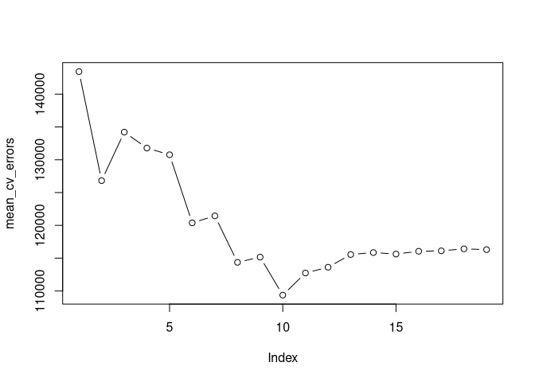<!-- -->

Based on minimizing the CV error, the cross-validation approach chooses
a 10-variable model.

``` r
reg_best <- regsubsets(Salary ~ ., data = Hitters, nvmax = 19)
coef(reg_best, 10)
```

    ##  (Intercept)        AtBat         Hits        Walks       CAtBat        CRuns 
    ##  162.5354420   -2.1686501    6.9180175    5.7732246   -0.1300798    1.4082490 
    ##         CRBI       CWalks    DivisionW      PutOuts      Assists 
    ##    0.7743122   -0.8308264 -112.3800575    0.2973726    0.2831680

## Ridge Regression and the Lasso

The `glmnet` package has the `glmnet()` function which is useful for
ridge regression, lasso models, and more. This does not use the same
syntax as `lm()`, so we will pass in an X matrix and a y vector. The X
matrix will include all of the original columns, coded numerically, with
the intercept removed (`[, -1]`).

``` r
X <- model.matrix(Salary ~ ., Hitters)[, -1]
y <- Hitters$Salary
```

### Ridge Regression

`glmnet()`’s `alpha` argument determines what type of model is fit. If
`alpha = 0`, then a ridge regression model is fit. If `alpha = 1`, then
a lasso model is fit.

Let’s fit a bunch of ridge regression models with 100 different values
of lambda ranging from 10<sup>10</sup> to 10<sup>−2</sup>. `glmnet()`
will standardize the variables by default.

``` r
grid <- 10^seq(10, -2, length = 100)
ridge_mod <- glmnet(X, y, alpha = 0, lmabda = grid)
dim(coef(ridge_mod))
```

    ## [1]  20 100

``` r
ridge_mod$lambda[1]
```

    ## [1] 255282.1

``` r
coef(ridge_mod)[, 1]
```

    ##   (Intercept)         AtBat          Hits         HmRun          Runs 
    ##  5.359259e+02  1.221172e-36  4.429736e-36  1.784944e-35  7.491019e-36 
    ##           RBI         Walks         Years        CAtBat         CHits 
    ##  7.912870e-36  9.312961e-36  3.808598e-35  1.048494e-37  3.858759e-37 
    ##        CHmRun         CRuns          CRBI        CWalks       LeagueN 
    ##  2.910036e-36  7.741531e-37  7.989430e-37  8.452752e-37 -1.301217e-35 
    ##     DivisionW       PutOuts       Assists        Errors    NewLeagueN 
    ## -1.751460e-34  4.891197e-37  7.989093e-38 -3.725027e-37 -2.585026e-36

``` r
ridge_mod$lambda[50]
```

    ## [1] 2674.375

``` r
coef(ridge_mod)[, 50]
```

    ##   (Intercept)         AtBat          Hits         HmRun          Runs 
    ## 213.066443434   0.090095728   0.371252756   1.180126956   0.596298287 
    ##           RBI         Walks         Years        CAtBat         CHits 
    ##   0.594502390   0.772525466   2.473494238   0.007597952   0.029272172 
    ##        CHmRun         CRuns          CRBI        CWalks       LeagueN 
    ##   0.217335716   0.058705097   0.060722036   0.058698830   3.276567828 
    ##     DivisionW       PutOuts       Assists        Errors    NewLeagueN 
    ## -21.889942619   0.052667119   0.007463678  -0.145121336   2.972759126

``` r
ridge_mod$lambda[100]
```

    ## [1] 25.52821

``` r
coef(ridge_mod)[, 100]
```

    ##   (Intercept)         AtBat          Hits         HmRun          Runs 
    ##  8.112693e+01 -6.815959e-01  2.772312e+00 -1.365680e+00  1.014826e+00 
    ##           RBI         Walks         Years        CAtBat         CHits 
    ##  7.130224e-01  3.378558e+00 -9.066800e+00 -1.199478e-03  1.361029e-01 
    ##        CHmRun         CRuns          CRBI        CWalks       LeagueN 
    ##  6.979958e-01  2.958896e-01  2.570711e-01 -2.789666e-01  5.321272e+01 
    ##     DivisionW       PutOuts       Assists        Errors    NewLeagueN 
    ## -1.228345e+02  2.638876e-01  1.698796e-01 -3.685645e+00 -1.810510e+01

We can see that as the value of lambda decreases down to
10<sup>−2</sup>, the magnitudes of the coefficients attached to the
model increase. With high values of lambda, the coefficients are
squashed into the ground, on the order of 10<sup>−37</sup> or so.

The ℓ<sub>2</sub> norm of one set of model coefficients can be found by
doing:

``` r
sqrt(sum(coef(ridge_mod)[-1, 50]^2))
```

    ## [1] 22.53415

We could now use the `predict()` function to get ridge regression
coefficients for a new value of *λ*, such as 50:

``` r
predict(ridge_mod, 
        s = 50, 
        type = "coefficients")[1:20, ]
```

    ##   (Intercept)         AtBat          Hits         HmRun          Runs 
    ##  4.821654e+01 -3.538650e-01  1.953167e+00 -1.285127e+00  1.156329e+00 
    ##           RBI         Walks         Years        CAtBat         CHits 
    ##  8.087771e-01  2.709765e+00 -6.202919e+00  6.085854e-03  1.070832e-01 
    ##        CHmRun         CRuns          CRBI        CWalks       LeagueN 
    ##  6.290984e-01  2.172926e-01  2.152888e-01 -1.488961e-01  4.586262e+01 
    ##     DivisionW       PutOuts       Assists        Errors    NewLeagueN 
    ## -1.182304e+02  2.501647e-01  1.208491e-01 -3.277073e+00 -9.423459e+00

We can now use a training set and a test set to estimate the test error
of ridge regression and lasso.

``` r
set.seed(1)
train <- sample(1:nrow(X), nrow(X)/2)
test <- (-train)
y_test <- y[test]
train
```

    ##   [1] 167 129 187  85  79 213  37 105 217 110 229 165  34 106 126  89 172 207
    ##  [19]  33  84 163  70  74  42 166 111 148 156  20  44 121  87 242 233  40 247
    ##  [37]  25 119 198 122  39 179 240 134  24 160  14 130  45 146  22 206 193 115
    ##  [55] 104 231 208 209 103  75  13 253 176 248  23 254 244 205  29 141 150 236
    ##  [73] 108  48 245 215 149  31 102 145  73 232  83 118  90 190 107  64 196  60
    ##  [91]  51 251 138 262  43  26 143 195 152 178 223 219 202 181 222 169   1 239
    ## [109]  78 211 246  28 116 257  61 113  86  71 225  99 173 234  49 256 174 194
    ## [127]  50 135 238 235 230

``` r
test
```

    ##   [1] -167 -129 -187  -85  -79 -213  -37 -105 -217 -110 -229 -165  -34 -106 -126
    ##  [16]  -89 -172 -207  -33  -84 -163  -70  -74  -42 -166 -111 -148 -156  -20  -44
    ##  [31] -121  -87 -242 -233  -40 -247  -25 -119 -198 -122  -39 -179 -240 -134  -24
    ##  [46] -160  -14 -130  -45 -146  -22 -206 -193 -115 -104 -231 -208 -209 -103  -75
    ##  [61]  -13 -253 -176 -248  -23 -254 -244 -205  -29 -141 -150 -236 -108  -48 -245
    ##  [76] -215 -149  -31 -102 -145  -73 -232  -83 -118  -90 -190 -107  -64 -196  -60
    ##  [91]  -51 -251 -138 -262  -43  -26 -143 -195 -152 -178 -223 -219 -202 -181 -222
    ## [106] -169   -1 -239  -78 -211 -246  -28 -116 -257  -61 -113  -86  -71 -225  -99
    ## [121] -173 -234  -49 -256 -174 -194  -50 -135 -238 -235 -230

This technique above works because the negation of the indices tells R
to not include those values, but include all other values.

Now we can fit a ridge regression model on the training set, and
evaluate its MSE on the test set using *λ* = 4.

``` r
ridge_mod <- glmnet(X[train, ], y[train], alpha = 0, 
                    lambda = grid, thresh = 1e-12)
ridge_pred <- predict(ridge_mod, s = 4, newx = X[test, ])
mean((ridge_pred - y_test)^2)
```

    ## [1] 142199.2

If we had fit a model with *just* an intercept, we would have predicted
each test observation using the mean of the training observations. In
this case, the MSE would be calculated like this:

``` r
mean((mean(y[train]) - y_test)^2)
```

    ## [1] 224669.9

We can also get this result by predicting a ridge model with a very
large value of *λ*:

``` r
ridge_pred <- predict(ridge_mod, s = 1e10, newx = X[test, ])
mean((ridge_pred - y_test)^2)
```

    ## [1] 224669.8

And if we fit a ridge model with *λ* = 0, we should get the same result
as least squares regression:

``` r
ridge_pred <- predict(ridge_mod, s = 0, newx = X[test, ], 
                      exact = T, x = X[train, ], y = y[train])
mean((ridge_pred - y_test)^2)
```

    ## [1] 168588.6

``` r
lm(y ~ X, subset = train)
```

    ## 
    ## Call:
    ## lm(formula = y ~ X, subset = train)
    ## 
    ## Coefficients:
    ## (Intercept)       XAtBat        XHits       XHmRun        XRuns         XRBI  
    ##    274.0145      -0.3521      -1.6377       5.8145       1.5424       1.1243  
    ##      XWalks       XYears      XCAtBat       XCHits      XCHmRun       XCRuns  
    ##      3.7287     -16.3773      -0.6412       3.1632       3.4008      -0.9739  
    ##       XCRBI      XCWalks     XLeagueN   XDivisionW     XPutOuts     XAssists  
    ##     -0.6005       0.3379     119.1486    -144.0831       0.1976       0.6804  
    ##     XErrors  XNewLeagueN  
    ##     -4.7128     -71.0951

``` r
predict(ridge_mod, s = 0, exact = T, type = "coefficients", 
        x = X[train, ], y = y[train])[1:20,]
```

    ##  (Intercept)        AtBat         Hits        HmRun         Runs          RBI 
    ##  274.0200994   -0.3521900   -1.6371383    5.8146692    1.5423361    1.1241837 
    ##        Walks        Years       CAtBat        CHits       CHmRun        CRuns 
    ##    3.7288406  -16.3795195   -0.6411235    3.1629444    3.4005281   -0.9739405 
    ##         CRBI       CWalks      LeagueN    DivisionW      PutOuts      Assists 
    ##   -0.6003976    0.3378422  119.1434637 -144.0853061    0.1976300    0.6804200 
    ##       Errors   NewLeagueN 
    ##   -4.7127879  -71.0898914

Instead of randomly choosing *λ* = 4, it’s better to use
cross-validation to choose the tuning parameter *λ*. We can use the
built-in function `cv.glmnet()` to perform ten-fold cross-validation:

``` r
set.seed(1)
cv_out <- cv.glmnet(X[train, ], y[train], alpha = 0)
plot(cv_out)
```

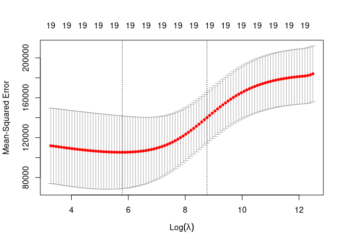<!-- -->

``` r
bestlam <- cv_out$lambda.min
bestlam
```

    ## [1] 326.0828

So we can see that the best lambda for minimizing cross-validation error
is 326. The test MSE associated with this value of lambda is:

``` r
ridge_pred <- predict(ridge_mod, s = bestlam, 
                      newx = X[test, ])
mean((ridge_pred - y_test)^2)
```

    ## [1] 139856.6

Finally, we refit our model on the full data set to improve our
coefficient estimates, using the value of *λ* we got from
cross-validation.

``` r
out <- glmnet(X, y, alpha = 0)
predict(out, type = "coefficients", s = bestlam)[1:20, ]
```

    ##  (Intercept)        AtBat         Hits        HmRun         Runs          RBI 
    ##  15.44383120   0.07715547   0.85911582   0.60103106   1.06369007   0.87936105 
    ##        Walks        Years       CAtBat        CHits       CHmRun        CRuns 
    ##   1.62444617   1.35254778   0.01134999   0.05746654   0.40680157   0.11456224 
    ##         CRBI       CWalks      LeagueN    DivisionW      PutOuts      Assists 
    ##   0.12116504   0.05299202  22.09143197 -79.04032656   0.16619903   0.02941950 
    ##       Errors   NewLeagueN 
    ##  -1.36092945   9.12487765

None of the coefficients are zero, because ridge regression does not
perform variable selection.

### The Lasso

This process is identical to that of ridge regression, but now we use
`alpha = 1` rather than `alpha = 0`.

``` r
lasso_mod <- glmnet(X[train, ], y[train], alpha = 1, 
                    lambda = grid)
plot(lasso_mod)
```

    ## Warning in regularize.values(x, y, ties, missing(ties), na.rm = na.rm):
    ## collapsing to unique 'x' values

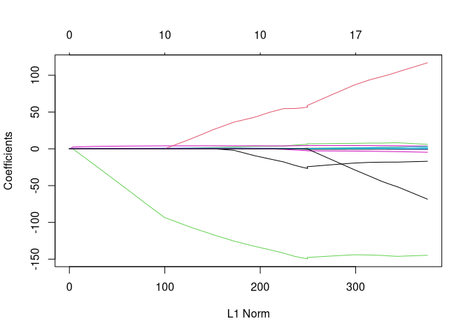<!-- -->

``` r
set.seed(1)
cv_out <- cv.glmnet(X[train, ], y[train], alpha = 1)
plot(cv_out)
```

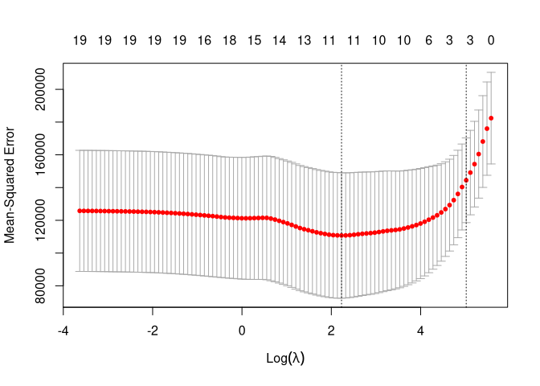<!-- -->

``` r
bestlam <- cv_out$lambda.min
lasso_pred <- predict(lasso_mod, s = bestlam, 
                      newx = X[test, ])
mean((lasso_pred - y_test)^2)
```

    ## [1] 143673.6

This is lower than the MSE of the null model and least squares, and
about equal to that of ridge regression. The lasso has a big advantage
over ridge regression, though, because the coefficients are *sparse*.

``` r
out <- glmnet(X, y, alpha = 1, lambda = grid)
lasso_coef <- predict(out, type = "coefficients", 
                      s = bestlam)[1:20, ]
lasso_coef
```

    ##   (Intercept)         AtBat          Hits         HmRun          Runs 
    ##    1.27479059   -0.05497143    2.18034583    0.00000000    0.00000000 
    ##           RBI         Walks         Years        CAtBat         CHits 
    ##    0.00000000    2.29192406   -0.33806109    0.00000000    0.00000000 
    ##        CHmRun         CRuns          CRBI        CWalks       LeagueN 
    ##    0.02825013    0.21628385    0.41712537    0.00000000   20.28615023 
    ##     DivisionW       PutOuts       Assists        Errors    NewLeagueN 
    ## -116.16755870    0.23752385    0.00000000   -0.85629148    0.00000000

``` r
lasso_coef[lasso_coef != 0]
```

    ##   (Intercept)         AtBat          Hits         Walks         Years 
    ##    1.27479059   -0.05497143    2.18034583    2.29192406   -0.33806109 
    ##        CHmRun         CRuns          CRBI       LeagueN     DivisionW 
    ##    0.02825013    0.21628385    0.41712537   20.28615023 -116.16755870 
    ##       PutOuts        Errors 
    ##    0.23752385   -0.85629148

The lasso has performed variable selection, which is good for us.

## PCR and PLS Regression

### Principal Components Regression

We can use the `pcr()` function from the `pls` library to perform
principal components regression.

``` r
set.seed(2)
pcr_fit <- pcr(Salary ~ ., data = Hitters, scale = TRUE, validation = "CV")
```

In this case, `scale = TRUE` standardizes the predictors, and
`validation = "CV"` performs ten-fold cross-validation for each possible
value of *M*, the number of principal components used.

``` r
summary(pcr_fit)
```

    ## Data:    X dimension: 263 19 
    ##  Y dimension: 263 1
    ## Fit method: svdpc
    ## Number of components considered: 19
    ## 
    ## VALIDATION: RMSEP
    ## Cross-validated using 10 random segments.
    ##        (Intercept)  1 comps  2 comps  3 comps  4 comps  5 comps  6 comps
    ## CV             452    351.9    353.2    355.0    352.8    348.4    343.6
    ## adjCV          452    351.6    352.7    354.4    352.1    347.6    342.7
    ##        7 comps  8 comps  9 comps  10 comps  11 comps  12 comps  13 comps
    ## CV       345.5    347.7    349.6     351.4     352.1     353.5     358.2
    ## adjCV    344.7    346.7    348.5     350.1     350.7     352.0     356.5
    ##        14 comps  15 comps  16 comps  17 comps  18 comps  19 comps
    ## CV        349.7     349.4     339.9     341.6     339.2     339.6
    ## adjCV     348.0     347.7     338.2     339.7     337.2     337.6
    ## 
    ## TRAINING: % variance explained
    ##         1 comps  2 comps  3 comps  4 comps  5 comps  6 comps  7 comps  8 comps
    ## X         38.31    60.16    70.84    79.03    84.29    88.63    92.26    94.96
    ## Salary    40.63    41.58    42.17    43.22    44.90    46.48    46.69    46.75
    ##         9 comps  10 comps  11 comps  12 comps  13 comps  14 comps  15 comps
    ## X         96.28     97.26     97.98     98.65     99.15     99.47     99.75
    ## Salary    46.86     47.76     47.82     47.85     48.10     50.40     50.55
    ##         16 comps  17 comps  18 comps  19 comps
    ## X          99.89     99.97     99.99    100.00
    ## Salary     53.01     53.85     54.61     54.61

We can plot the cross-validation scores using the `validationplot()`
function, using `val.type = "MSEP"`, which indicates that the MSE should
be plotted.

``` r
validationplot(pcr_fit, val.type = "MSEP")
```

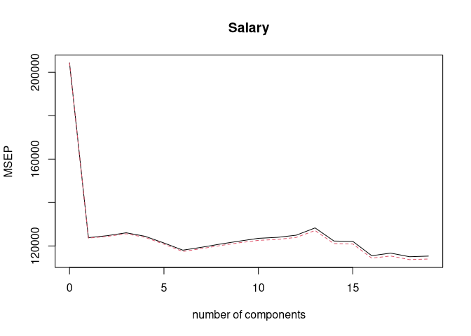<!-- -->

``` r
set.seed(1)
pcr_fit <- pcr(Salary ~ ., data = Hitters, subset = train, 
               scale = TRUE, validation = "CV")
validationplot(pcr_fit, val.type = "MSEP")
```

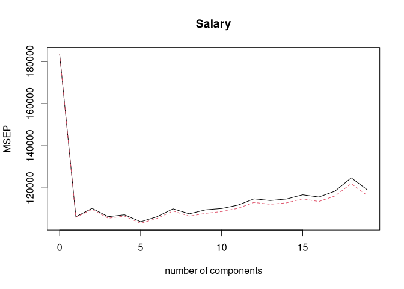<!-- -->

We can note that on the training data, we get the lowest MSE with
*M* = 5 components. The test MSE is then computed by:

``` r
pcr_pred <- predict(pcr_fit, X[test, ], ncomp = 5)
mean((pcr_pred - y_test)^2)
```

    ## [1] 142811.8

This MSE is also competitive with the lasso and ridge regression MSEs.
Now that we’ve cross-validated to find the best value of *M*, we fit the
model to the whole data set to get the most accurate coefficients.

``` r
pcr_fit <- pcr(y ~ X, scale = TRUE, ncomp = 5)
summary(pcr_fit)
```

    ## Data:    X dimension: 263 19 
    ##  Y dimension: 263 1
    ## Fit method: svdpc
    ## Number of components considered: 5
    ## TRAINING: % variance explained
    ##    1 comps  2 comps  3 comps  4 comps  5 comps
    ## X    38.31    60.16    70.84    79.03    84.29
    ## y    40.63    41.58    42.17    43.22    44.90

### Partial Least Squares

This is identical to PCR, but we use the `plsr()` function instead.

``` r
set.seed(1)
pls_fit <- plsr(Salary ~ ., data = Hitters, subset = train, scale = TRUE, validation = "CV")
summary(pls_fit)
```

    ## Data:    X dimension: 131 19 
    ##  Y dimension: 131 1
    ## Fit method: kernelpls
    ## Number of components considered: 19
    ## 
    ## VALIDATION: RMSEP
    ## Cross-validated using 10 random segments.
    ##        (Intercept)  1 comps  2 comps  3 comps  4 comps  5 comps  6 comps
    ## CV           428.3    325.5    329.9    328.8    339.0    338.9    340.1
    ## adjCV        428.3    325.0    328.2    327.2    336.6    336.1    336.6
    ##        7 comps  8 comps  9 comps  10 comps  11 comps  12 comps  13 comps
    ## CV       339.0    347.1    346.4     343.4     341.5     345.4     356.4
    ## adjCV    336.2    343.4    342.8     340.2     338.3     341.8     351.1
    ##        14 comps  15 comps  16 comps  17 comps  18 comps  19 comps
    ## CV        348.4     349.1     350.0     344.2     344.5     345.0
    ## adjCV     344.2     345.0     345.9     340.4     340.6     341.1
    ## 
    ## TRAINING: % variance explained
    ##         1 comps  2 comps  3 comps  4 comps  5 comps  6 comps  7 comps  8 comps
    ## X         39.13    48.80    60.09    75.07    78.58    81.12    88.21    90.71
    ## Salary    46.36    50.72    52.23    53.03    54.07    54.77    55.05    55.66
    ##         9 comps  10 comps  11 comps  12 comps  13 comps  14 comps  15 comps
    ## X         93.17     96.05     97.08     97.61     97.97     98.70     99.12
    ## Salary    55.95     56.12     56.47     56.68     57.37     57.76     58.08
    ##         16 comps  17 comps  18 comps  19 comps
    ## X          99.61     99.70     99.95    100.00
    ## Salary     58.17     58.49     58.56     58.62

``` r
validationplot(pls_fit, val.type = "MSEP")
```

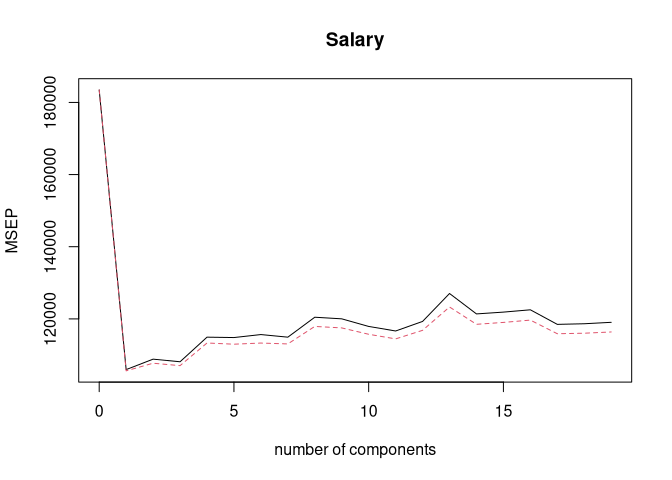<!-- --> The lowest
MSE occurs when only *M* = 1 partial least squares directions are used.
The test set MSE is then:

``` r
pls_pred <- predict(pls_fit, X[test, ], ncomp = 1)
mean((pls_pred - y_test)^2)
```

    ## [1] 151995.3

This is comparable to Ridge, Lasso, and PCR, but slightly higher. Now we
construct a model on the whole dataset using one component.

``` r
pls_fit <- plsr(Salary ~ ., data = Hitters, scale = TRUE, ncomp = 1)
summary(pls_fit)
```

    ## Data:    X dimension: 263 19 
    ##  Y dimension: 263 1
    ## Fit method: kernelpls
    ## Number of components considered: 1
    ## TRAINING: % variance explained
    ##         1 comps
    ## X         38.08
    ## Salary    43.05
