Chapter 8 Labs: Tree-Based Methods
================

-   [Fitting Classification Trees](#fitting-classification-trees)
-   [Fitting Regression Trees](#fitting-regression-trees)
-   [Bagging and Random Forests](#bagging-and-random-forests)
-   [Boosting](#boosting)
-   [Bayesian Additive Regression
    Trees](#bayesian-additive-regression-trees)

## Fitting Classification Trees

We use the `tree` library to construct classification and regression
trees. We’ll make a new categorical variable in the `Carseats` data set
by recoding the `Sales` variable as being `High` or not. We’ll then
construct a classification tree to predict whether the sales are high or
not from everything except sales.

``` r
Carseats$High <- factor(ifelse(Carseats$Sales <= 8, "No", "Yes"))
tree_carseats <- tree(High ~ . - Sales, data = Carseats)
summary(tree_carseats)
```

    ## 
    ## Classification tree:
    ## tree(formula = High ~ . - Sales, data = Carseats)
    ## Variables actually used in tree construction:
    ## [1] "ShelveLoc"   "Price"       "Income"      "CompPrice"   "Population" 
    ## [6] "Advertising" "Age"         "US"         
    ## Number of terminal nodes:  27 
    ## Residual mean deviance:  0.4575 = 170.7 / 373 
    ## Misclassification error rate: 0.09 = 36 / 400

We can also plot the tree using the `plot()` function:

``` r
plot(tree_carseats)
text(tree_carseats, pretty = 0)
```

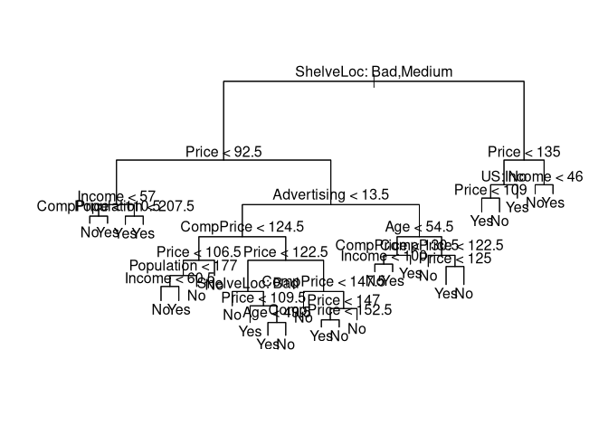<!-- -->

The summary gives us the training error rather than the test error, so
we need to manually calculate the test error using the `predict()`
function.

``` r
set.seed(2)
train <- sample(1:nrow(Carseats), 200)
Carseats_test <- Carseats[-train, ]
High_test <- Carseats$High[-train]

tree_carseats <- tree(High ~ . - Sales, data = Carseats, subset = train)
tree_pred <- predict(tree_carseats, Carseats_test, type = "class")
table(tree_pred, High_test)
```

    ##          High_test
    ## tree_pred  No Yes
    ##       No  104  33
    ##       Yes  13  50

``` r
mean(tree_pred == High_test)
```

    ## [1] 0.77

So our classification tree has a prediction accuracy of 77%.

We can now prune the tree. We use the function `cv.tree()` to perform
cross-validation to determine the optimal level of complexity. We use
`FUN = prune.misclass` to indicate that we want the classification error
rate to guide the process rather than the deviance.

The `size` variable represents the number of terminal nodes in each
tree, and the `k` variable corresponds to the complexity parameter *α*
from the chapter.

``` r
set.seed(7)
cv_carseats <- cv.tree(tree_carseats, FUN = prune.misclass)
names(cv_carseats)
```

    ## [1] "size"   "dev"    "k"      "method"

``` r
cv_carseats
```

    ## $size
    ## [1] 21 19 14  9  8  5  3  2  1
    ## 
    ## $dev
    ## [1] 75 75 75 74 82 83 83 85 82
    ## 
    ## $k
    ## [1] -Inf  0.0  1.0  1.4  2.0  3.0  4.0  9.0 18.0
    ## 
    ## $method
    ## [1] "misclass"
    ## 
    ## attr(,"class")
    ## [1] "prune"         "tree.sequence"

We can notice that the tree with 9 terminal nodes has only 74
cross-validation errors (given by `dev`).

``` r
par(mfrow = c(1, 2))
plot(cv_carseats$size, cv_carseats$dev, type = "b")
plot(cv_carseats$k, cv_carseats$dev, type = "b")
```

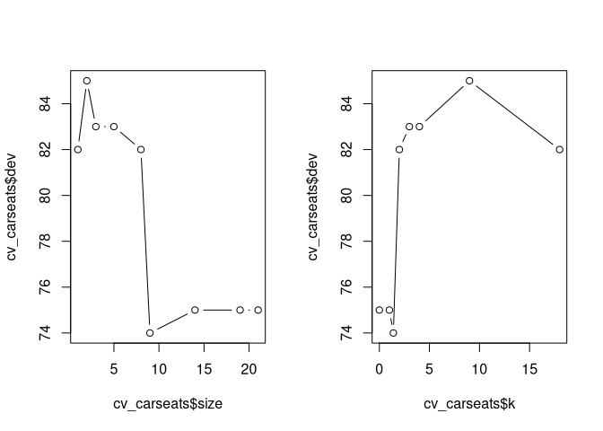<!-- -->

We can now prune the tree so as to only have nine terminal nodes:

``` r
prune_carseats <- prune.misclass(tree_carseats, best = 9)
plot(prune_carseats)
text(prune_carseats, pretty = 0)
```

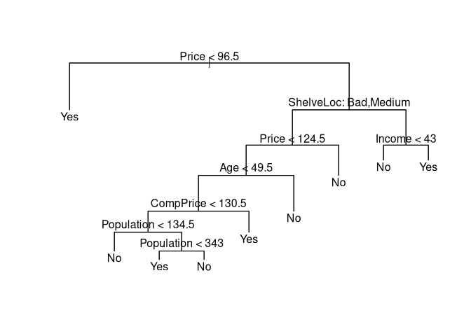<!-- -->

We’ll now see how well it does on the test data set.

``` r
tree_pred <- predict(prune_carseats, Carseats_test, 
                     type = "class")
table(tree_pred, High_test)
```

    ##          High_test
    ## tree_pred No Yes
    ##       No  97  25
    ##       Yes 20  58

``` r
mean(tree_pred == High_test)
```

    ## [1] 0.775

We now have a 77.5% classification accuracy, which is slightly improved
over our *T*<sub>0</sub> tree and MUCH more interpretable.

## Fitting Regression Trees

We’ll fit a regression tree to the `Boston` data set.

``` r
set.seed(1)
train <- sample(1:nrow(Boston), nrow(Boston)/2)
tree_boston <- tree(medv ~ ., Boston, subset = train)
summary(tree_boston)
```

    ## 
    ## Regression tree:
    ## tree(formula = medv ~ ., data = Boston, subset = train)
    ## Variables actually used in tree construction:
    ## [1] "rm"    "lstat" "crim"  "age"  
    ## Number of terminal nodes:  7 
    ## Residual mean deviance:  10.38 = 2555 / 246 
    ## Distribution of residuals:
    ##     Min.  1st Qu.   Median     Mean  3rd Qu.     Max. 
    ## -10.1800  -1.7770  -0.1775   0.0000   1.9230  16.5800

We can notice that only 4 of the variables were used in constructing the
regression tree, hence performing variable selection. The deviance is
just the sum of squared errors (SSE) for the tree.

``` r
plot(tree_boston)
text(tree_boston, pretty = 0)
```

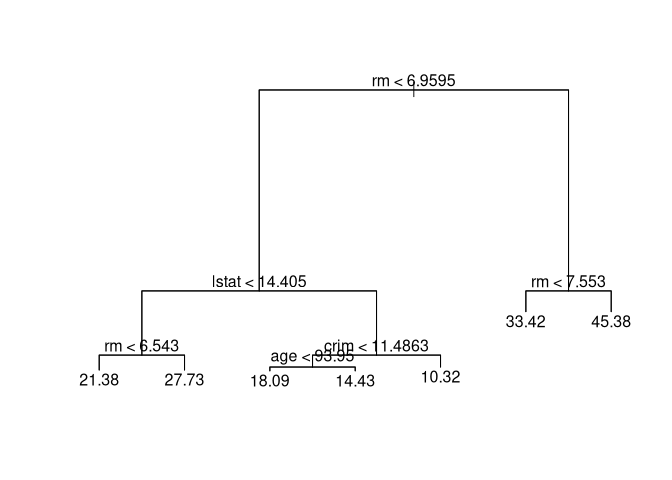<!-- -->

We can now use `cv.tree()` to see if pruning the tree will improve the
performance.

``` r
cv_boston <- cv.tree(tree_boston)
plot(cv_boston$size, cv_boston$dev, type = "b")
```

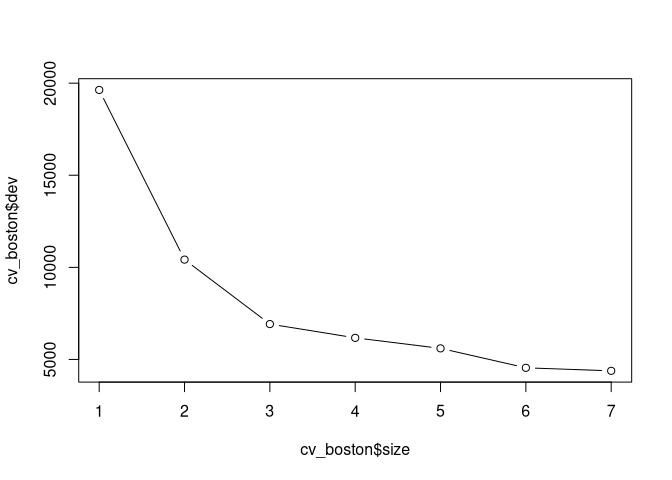<!-- --> In this
case, the most complex tree yields the lowest cross-validation deviance.
If we wanted to prune the tree, though, we could do so using the
`prune.tree()` function:

``` r
prune_boston <- prune.tree(tree_boston, best = 5)
plot(prune_boston)
text(prune_boston, pretty = 0)
```

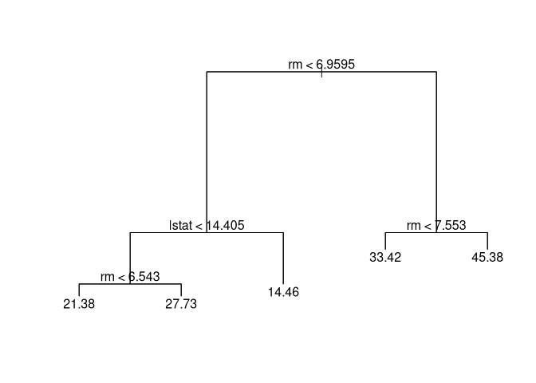<!-- -->

Let’s use the unpruned tree to make predictions on the test set:

``` r
yhat <- predict(tree_boston, newdata = Boston[-train, ])
boston_test <- Boston[-train, "medv"]
plot(yhat, boston_test)
abline(0, 1)
```

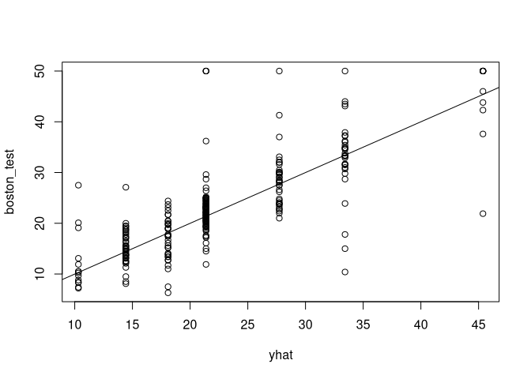<!-- -->

``` r
mean((yhat - boston_test)^2)
```

    ## [1] 35.28688

the RMSE then, is around 5.941, meaning that test predictions are (on
average) within approximately $5,941 of the true median home value for
the census tract.

## Bagging and Random Forests

We use the `randomForest` package to use bagging and random forests.
Because bagging is a special case of random forests, to use bagging we
simply let *m* = *p*.

``` r
set.seed(1)
bag_boston <- randomForest(medv ~ ., data = Boston, 
                           subset = train, 
                           mtry = 12, 
                           importance = TRUE)

bag_boston
```

    ## 
    ## Call:
    ##  randomForest(formula = medv ~ ., data = Boston, mtry = 12, importance = TRUE,      subset = train) 
    ##                Type of random forest: regression
    ##                      Number of trees: 500
    ## No. of variables tried at each split: 12
    ## 
    ##           Mean of squared residuals: 11.40162
    ##                     % Var explained: 85.17

By default, 500 trees are grown. How well does this perform on the test
set?

``` r
yhat_bag <- predict(bag_boston, newdata = Boston[-train, ])
plot(yhat_bag, boston_test)
abline(0, 1)
```

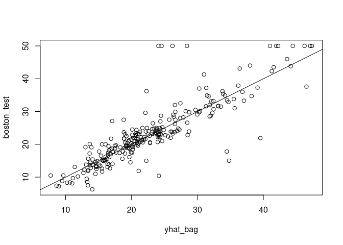<!-- -->

``` r
mean((yhat_bag - boston_test)^2)
```

    ## [1] 23.41916

Our test MSE is about two-thirds that of the single tree, a good
improvement. We can change the number of trees grown by `randomForest()`
using the `ntree` argument:

``` r
bag_boston <- randomForest(medv ~ ., data = Boston, 
                           subset = train, 
                           mtry = 12, ntree = 25)
yhat_bag <- predict(bag_boston, newdata = Boston[-train, ])
mean((yhat_bag - boston_test)^2)
```

    ## [1] 25.75055

This is a slightly higher MSE than we got with 500 trees, which makes
sense.

We’ll now grow a random forest, using `mtry = 6`. By default,
`randomForest()` will use *p*/3 variables for regression trees, and
$\\sqrt{p}$ for classification trees.

``` r
set.seed(1)
rf_boston <- randomForest(medv ~ ., data = Boston, 
                          subset = train, mtry = 6, 
                          importance = TRUE)
yhat_rf <- predict(rf_boston, newdata = Boston[-train, ])
mean((yhat_rf - boston_test)^2)
```

    ## [1] 20.06644

We can now try with *m* = 5 to see how they compare:

``` r
set.seed(1)
rf_boston <- randomForest(medv ~ ., data = Boston, 
                          subset = train, mtry = 5, 
                          importance = TRUE)
yhat_rf <- predict(rf_boston, newdata = Boston[-train, ])
mean((yhat_rf - boston_test)^2)
```

    ## [1] 18.76913

This yielded an improvement over the *m* = 6 random forest, and a pretty
good improvement over bagging as well.

We can use the `importance()` function to view the importance of each
variable:

``` r
importance(rf_boston)
```

    ##           %IncMSE IncNodePurity
    ## crim    15.575852    1134.30710
    ## zn       2.252634     139.23395
    ## indus    5.658903     611.36057
    ## chas     1.848363      36.58809
    ## nox     12.506322     979.80105
    ## rm      32.263223    7286.84856
    ## age     13.282360     666.24893
    ## dis      9.391319     735.89946
    ## rad      3.720857     112.24746
    ## tax     10.929907     426.71806
    ## ptratio  8.881683     947.70817
    ## lstat   26.520031    6095.40030

A plot of this can be constructed using the `varImpPlot()` function:

``` r
varImpPlot(rf_boston)
```

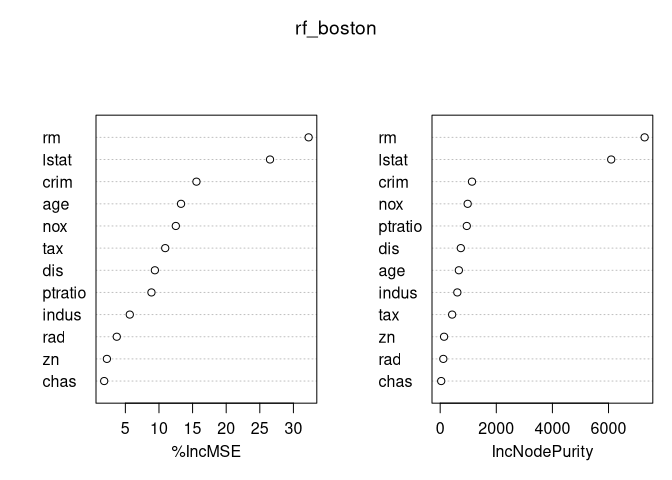<!-- -->

The two variables reported in the variable importance data are:

-   Mean decrease in prediction accuracy on the out-of-bag samples when
    a given variable is permuted.

-   Measure of the total decrease in node impurity (or increase in node
    purity) that results from a split over that variable, averaged over
    all trees. With regression trees, node impurity is measured by the
    training RSS, and for classification it’s measured by the deviance.

Clearly, `rm` and `lstat` are the two most important variables.

## Boosting

We use the `gbm` package for boosting, with the `gbm()` function. We’ll
fit boosted trees to the `Boston` data set as well.

For regression, we use `distribution = "gaussian"`, whereas for a binary
classification problem we would use `distribution = "bernoulli"`.
`n.trees` controls how many trees, and `interaction.depth` controls the
depth of each tree.

``` r
set.seed(1)
boost_boston <- gbm(medv ~ ., data = Boston[train, ], 
                    distribution = "gaussian", 
                    n.trees = 5000, 
                    interaction.depth = 4)
summary(boost_boston)
```

<!-- -->

    ##             var     rel.inf
    ## rm           rm 44.48249588
    ## lstat     lstat 32.70281223
    ## crim       crim  4.85109954
    ## dis         dis  4.48693083
    ## nox         nox  3.75222394
    ## age         age  3.19769210
    ## ptratio ptratio  2.81354826
    ## tax         tax  1.54417603
    ## indus     indus  1.03384666
    ## rad         rad  0.87625748
    ## zn           zn  0.16220479
    ## chas       chas  0.09671228

This is a relative influence plot, but we can also provide partial
dependence plots for the topmost two variables:

``` r
plot(boost_boston, i = "rm")
```

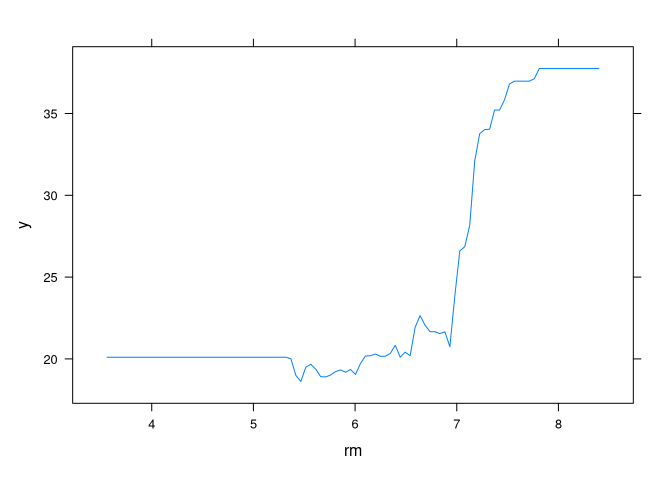<!-- -->

``` r
plot(boost_boston, i = "lstat")
```

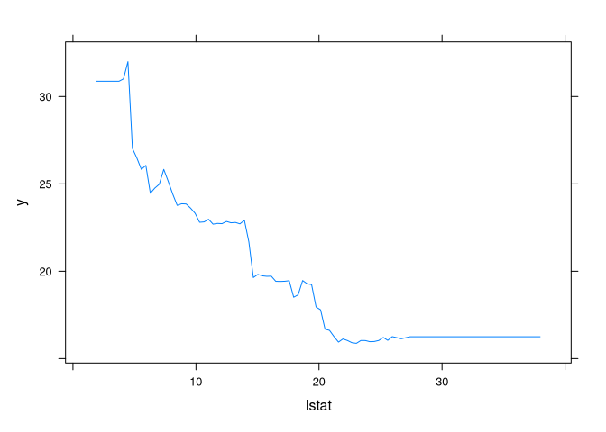<!-- -->

As we would expect, median house prices increase with `rm` and decrease
with `lstat`.

We can calculate the test MSE for this as well using the `predict()`
function:

``` r
yhat_boost <- predict(boost_boston, 
                      newdata = Boston[-train, ], 
                      n.trees = 5000)
mean((yhat_boost - boston_test)^2)
```

    ## [1] 18.39057

Now we’ll try performing this with a different shrinkage parameter *λ*.
The default value is 0.001, but this can be easily modified. Let’s try
*λ* = 0.2.

``` r
boost_boston <- gbm(medv ~ ., data = Boston[train, ], 
                    distribution = "gaussian", 
                    n.trees = 5000, 
                    interaction.depth = 4, 
                    shrinkage = 0.2, 
                    verbose = F)
yhat_boost <- predict(boost_boston, 
                      newdata = Boston[-train, ], 
                      n.trees = 5000)
mean((yhat_boost - boston_test)^2)
```

    ## [1] 16.54778

We can clearly see that changing the shrinkage parameter to 0.2 from
0.001 resulted in a much better test MSE, outperforming decision trees,
bagging, and random forests.

## Bayesian Additive Regression Trees

For Bayesian Additive Regression Trees, we will use the `BART` package,
specifically the `gbart()` function. This is used for regression,
whereas the `lbart()` and `pbart()` functions are used for binary,
categorical outcomes.

Unfortunately, the `gbart()` function does not take in the same syntax
as `lm()` or the rest of the functions from this chapter, and we have to
create train and test matrices.

``` r
x <- Boston[, 1:12]
y <- Boston[, "medv"]

xtrain <- x[train, ]
ytrain <- y[train]

xtest <- x[-train, ]
ytest <- y[-train]

set.seed(1)
bartfit <- gbart(xtrain, ytrain, x.test = xtest)
```

    ## *****Calling gbart: type=1
    ## *****Data:
    ## data:n,p,np: 253, 12, 253
    ## y1,yn: 0.213439, -5.486561
    ## x1,x[n*p]: 0.109590, 20.080000
    ## xp1,xp[np*p]: 0.027310, 7.880000
    ## *****Number of Trees: 200
    ## *****Number of Cut Points: 100 ... 100
    ## *****burn,nd,thin: 100,1000,1
    ## *****Prior:beta,alpha,tau,nu,lambda,offset: 2,0.95,0.795495,3,3.71636,21.7866
    ## *****sigma: 4.367914
    ## *****w (weights): 1.000000 ... 1.000000
    ## *****Dirichlet:sparse,theta,omega,a,b,rho,augment: 0,0,1,0.5,1,12,0
    ## *****printevery: 100
    ## 
    ## MCMC
    ## done 0 (out of 1100)
    ## done 100 (out of 1100)
    ## done 200 (out of 1100)
    ## done 300 (out of 1100)
    ## done 400 (out of 1100)
    ## done 500 (out of 1100)
    ## done 600 (out of 1100)
    ## done 700 (out of 1100)
    ## done 800 (out of 1100)
    ## done 900 (out of 1100)
    ## done 1000 (out of 1100)
    ## time: 3s
    ## trcnt,tecnt: 1000,1000

Now we can compute the test error:

``` r
yhat_bart <- bartfit$yhat.test.mean
mean((ytest - yhat_bart)^2)
```

    ## [1] 15.94718

This yielded the lowest test error of all the techniques seen in this
lab.

We can now check how many times each variable appeared in teh collection
of all the trees.

``` r
ord <- order(bartfit$varcount.mean, decreasing = T)
bartfit$varcount.mean[ord]
```

    ##     nox   lstat     tax     rad      rm   indus    chas ptratio     age      zn 
    ##  22.952  21.329  21.250  20.781  19.890  19.825  19.051  18.976  18.274  15.952 
    ##     dis    crim 
    ##  14.457  11.007
